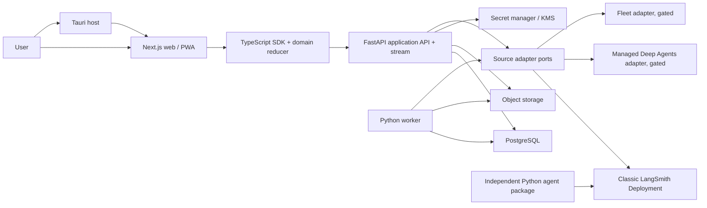
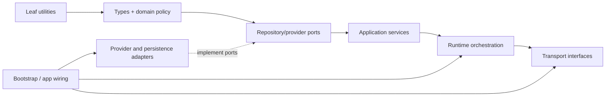
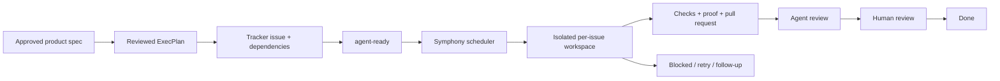

# Deep Work consolidated product, architecture, and delivery plan

## 1. Program status

This is the canonical program-level plan. Wave 0 installed the repository knowledge
system, accepted the 43 product/architecture decisions with recorded amendments,
preserved 39 stable feature IDs and their release assignments, and retained 179
feature scenarios plus 12 v1 program scenarios. No product runtime was implemented.

The next authorized unit is the reviewed repository-scaffold ExecPlan at
[`docs/exec-plans/active/DW-EXEC-M1-REPOSITORY-SCAFFOLD.md`](exec-plans/active/DW-EXEC-M1-REPOSITORY-SCAFFOLD.md).
Its scope is the credential-free monorepo and validation skeleton only. External
capabilities remain unavailable until their named spike passes or their documented
fallback is deliberately shipped.

Symphony remains gated by `SPIKE-SYMPHONY-001`. There is no executable root
`WORKFLOW.md`; manual one-agent-per-worktree dispatch is the current method.

## 2. Outcome and product boundary

Deep Work is an open-source control surface for delegating, supervising,
approving, and verifying long-running agent work across desktop and phone. Its
first release makes one high-value loop dependable:

> A user connects a supported agent source, starts a bounded task, follows real
> progress, responds to approvals, reviews evidence and artifacts, and safely
> reaches a useful result from a desktop or phone.

The initial coding outcome is a draft pull request with tests and reviewable
evidence. Research and writing use the same task loop with journey-specific
artifacts and verification. Deep Work does not claim to replace LangGraph Agent
Server, LangSmith Deployment, LangSmith traces, a source's sandbox, GitHub, or
official deployment tooling.

### V1 audience

- Primary: an individual technical user operating within an organization or
  workspace that may later contain a team.
- Compatibility constraint: all durable rows and authorization checks carry
  tenant and actor identity from the beginning; v1 does not promise complete
  team administration or RBAC.
- Contributor audience: LangChain and Deep Agents contributors should recognize
  the Python package method, public-API discipline, typed boundaries, test
  taxonomy, and issue/PR workflow without Deep Work copying private upstream
  internals.

### V1 release boundary

V1 includes:

- classic LangSmith Deployment as the supported public runtime baseline;
- capability-detected Managed Deep Agents and Fleet adapters only where pinned
  live evidence proves an entitled capability;
- API-key source connection as the deterministic auth fallback, with OAuth only
  where its audience and scopes pass the auth spike;
- five primary destinations: Tasks, Approvals, Agents, Schedules, and Activity;
- a complete responsive Next.js web application, with install/PWA/push enabled on
  browser cells that pass their qualification spike;
- a thin Tauri desktop host after remote-origin, auth, deep-link, notification,
  and updater qualification;
- a Python application service, durable application state, background work, and
  server-only provider credentials;
- coding, research, and writing task journeys, with coding capabilities enabled
  only when sandbox, files, GitHub, and egress contracts pass;
- explicit loading, empty, error, offline, permission, reconnect, stale-data,
  degraded-source, and mobile behavior; and
- fixture mode, contributor tooling, architecture enforcement, documentation
  checks, accessibility, security, observability, and release evidence.

V1 does not include native Expo mobile, public Fleet CRUD, an invented global
thread-search API, reimplementation of `mda deploy`, arbitrary MDA connector
routes, a pure-OSS Agent Server replacement, full team RBAC, uncontrolled memory
writes, or automatic merge of generated code.

## 3. Evidence and authority

The program is pinned to the repositories and hashes in the
[source ledger](references/source-ledger.md). Product and contract decisions use this
precedence:

1. accepted live-contract spike against an exact server, package, account tier,
   region, and date;
2. generated contract or official primary documentation for the pinned version;
3. accepted Deep Work decision and canonical architecture;
4. approved feature plan;
5. internal research; and
6. prototype behavior or fixture.

For contributor method inside a reference repository, passing tests and executable
configuration outrank manifests and generated artifacts, which outrank scoped
instructions and prose. Reference source code may prove a useful practice or
candidate public component; it is not authority for a hosted service contract.

This plan also adopts three official engineering sources:

- [OpenAI Harness Engineering](https://openai.com/index/harness-engineering/)
  for a short repository map, repository-local knowledge, living plans,
  architecture enforcement, agent-legible feedback, and recurring cleanup;
- [Codex ExecPlan guidance](https://developers.openai.com/cookbook/articles/codex_exec_plans)
  for self-contained living implementation plans with progress, decisions,
  discoveries, exact validation, and recovery; and
- the [OpenAI Symphony overview](https://openai.com/index/open-source-codex-orchestration-symphony/)
  and [pinned Symphony specification](https://github.com/openai/symphony/blob/1f3219bb1ea5f69a1305dc594e79b0db57c113c5/SPEC.md)
  for issue-driven scheduling, isolated per-issue workspaces, bounded concurrency,
  repository-owned workflow policy, reconciliation, and retry.

Symphony is an engineering-preview developer orchestrator, not a product runtime,
application job queue, or substitute for review. Its inclusion here is a governed
pilot with `SPIKE-SYMPHONY-001`, not an unverified claim that the desired tracker
adapter already exists.

## 4. Consolidated decisions

The detailed rationale and consequences live in the
[decision register](design-docs/decisions/index.md). The decisions that shape the
whole program are:

| Area | Decision | Practical consequence |
|---|---|---|
| Runtime baseline | Classic LangSmith Deployment is the public v1 baseline. | MDA is a private-beta capability adapter; Fleet is connect/read/invoke only where proven. |
| Backend | Python 3.12, FastAPI, Pydantic v2, SQLAlchemy 2, Alembic, and PostgreSQL. | The web process is not the durable backend and provider integration is not duplicated in TypeScript. |
| Process split | API and worker are separate entry points from one independently locked application-service distribution. | Requests remain bounded; accepted jobs survive API restarts through a transactional Postgres outbox/job model. |
| Agent package | `packages/agent` is independently locked, tested, versioned, and deployed. | It composes public Deep Agents/LangChain APIs and never imports application persistence or credentials. |
| Objects | Application-owned attachments/imports/exports use S3-compatible object storage. | Bytes do not live in Postgres rows; retention, scanning, authorization, and deletion are explicit. |
| Web | Next.js 16, React 19, TypeScript, App Router. | It owns presentation, responsive journeys, and thin same-origin mediation—not provider secrets or authoritative jobs. |
| Client packages | Pure `packages/domain`, browser-safe `packages/sdk`, presentational `packages/ui`. | Raw wire/provider payloads and React app state cannot become shared domain contracts. |
| Stream | FastAPI normalizes upstream sources into one application stream. | Provider credentials and cursors stay server-side; the browser receives an opaque application recovery token. |
| Mobile | Complete responsive web is mobile v1; install/PWA/push are per-browser qualified enhancements. | Expo is a post-v1 decision driven by measured lifecycle and native-capability gaps. |
| Desktop | Tauri v2 is a thin exact-trusted-origin host. | It adds native integration without forking product logic; qualification may hold desktop without holding web. |
| Durability | Replace “no database” with data minimization and explicit ownership. | LangSmith remains authoritative for upstream agents/threads/runs/traces; Deep Work persists product-required state and projections. |
| Auth | Application session plus server-held API key is the unconditional fallback. | OAuth ships only where every required API plane accepts the proven token audience and scopes. |
| Task aggregation | Query each registered source independently and aggregate normalized projections. | Partial failure, permissions, ordering, and pagination remain source-qualified. |
| Approvals | Preserve aligned HITL request/config arrays and one ordered decision per action. | Never flatten, partially submit, or guess a resume payload. |
| Agent editing | Save validated versioned drafts; Deploy is explicit. | No auto-save mutates live production state; CLI handoff is honest where in-app deployment is unsupported. |
| Product IA | Tasks, Approvals, Agents, Schedules, Activity; Settings is a utility route. | Agent, environment, workspace, and deployment configuration have separate owners. |
| Harness | Docs are repository state; root `AGENTS.md` is a compact map; architecture is machine-checked. | Agents and humans navigate the same sources and receive actionable boundary failures. |
| Orchestration | Symphony consumes reviewed, dependency-aware work items from a tracker. | Only eligible `agent-ready` work dispatches; each issue gets an isolated workspace and human review remains a normal terminal handoff. |

## 5. Application architecture

The full accepted design is [application-architecture.md](design-docs/architecture/application-architecture.md).
This section is the program contract.



### Deployable units

| Unit | Responsibility | Must not own |
|---|---|---|
| `apps/api` API | sessions, authorization, source registry, queries/mutations, capability views, normalized stream, object authorization | agent graph implementation, UI, reusable provider credentials in responses |
| `apps/api` worker | outbox delivery, webhook reconciliation, source refresh, notification delivery, object lifecycle, scheduled application work | product UI, Symphony development scheduling |
| `packages/agent` | deployable Deep Agents graph, approved middleware, runtime tools and configuration | FastAPI routes, application tables, product sessions, browser state |
| `apps/web` | responsive product journeys, accessibility, local ephemeral state, application API consumption | durable job truth, provider secrets, raw upstream protocol logic |
| `apps/desktop` | secure native bootstrap, exact-origin allow-list, deep links, tray, notification bridge, signed updater | a second domain or network client |
| PostgreSQL | application identities, sessions, source records, safe projections, drafts, preferences, idempotency, jobs/outbox, audit | upstream run/trace authority, object bytes, raw secrets |
| Object store | authorized application-owned bytes and derived safe previews | permanent provider credentials, unbounded provider mirrors |

### State ownership

| State | Authority | Deep Work posture |
|---|---|---|
| Agent/assistant/deployment definition | selected source | retain identity, capability, health, and reviewed application metadata; refetch source truth |
| Thread/run/checkpoint/interrupt | selected source | maintain qualified projection and recovery metadata; never overwrite upstream truth |
| Application task view | Deep Work | normalized per-source projection with provenance and stale state |
| Session, tenant, actor, preference | Deep Work | durable, tenant-scoped, revocable, audited |
| Credential | secret manager/KMS | DB stores opaque server reference and health only; clients never receive the reference |
| Attachment/import/export | Deep Work object store | bounded, scanned, authorized, retained, and deleted by policy |
| Trace | LangSmith/source | store qualified link/provenance and optional slim summary, not a second trace store |
| Agent draft/deploy request | Deep Work plus source | draft/version/audit in Deep Work; active source revision confirmed from source |
| Fixture | repository | synthetic, schema-valid, credential-free, deterministic, and parity-tested |

### API and stream boundary

- `/api/v1` is the versioned application contract; OpenAPI is generated and
  reviewed as a source artifact.
- The SDK validates wire data, maps DTOs into pure domain types, and keeps queries
  and mutations separate from active-stream control.
- The application stream has stable normalized event kinds, source provenance,
  monotonic application sequence, and an opaque recovery token. Provider event
  IDs/cursors remain in server adapter state.
- Reconnect first attempts bounded application replay, then refetches durable
  source/application truth. The UI distinguishes live, catching up, stale,
  recovered, and history-only states.
- HITL submission is all-or-nothing for the ordered batch. A stale batch triggers
  refetch; no “mark resolved” mutation invents source state.

### Failure posture

Each source is an independent failure domain. One unavailable source does not
blank the inbox or approval queue. Every surface declares loading, first-empty,
filtered-empty, permission, offline, source-unavailable, stale-projection,
reconnecting, recovery-expired, unknown-event, and destructive-action conflict
behavior. The deterministic fallback is the shipped behavior until a named spike
proves the richer capability.

## 6. Repository architecture and harness

### Target repository map

After review, the canonical repository should converge on this shape. Files in
the historical proposal are retained as references; the canonical document tree
now exists. Runtime package paths in this diagram remain planned until Wave 1.

```text
deepwork/
├── AGENTS.md                         # short map and invariant summary
├── ARCHITECTURE.md                   # canonical system/package/layer graph
├── WORKFLOW.md                       # absent until the Symphony spike passes
├── CONTRIBUTING.md
├── CODE_OF_CONDUCT.md
├── SECURITY.md                       # disclosure entry point
├── Makefile                          # stable human/agent command contract
├── apps/
│   ├── api/
│   ├── web/
│   └── desktop/
├── packages/
│   ├── agent/
│   ├── domain/
│   ├── sdk/
│   └── ui/
├── internal/
│   ├── fixtures/
│   ├── adapter-tests/
│   └── tsconfig/
├── tools/
│   ├── architecture/
│   ├── docs/
│   └── worktree/
└── docs/
    ├── AGENTS.md
    ├── DESIGN.md
    ├── FRONTEND.md
    ├── PLANS.md
    ├── PRODUCT_SENSE.md
    ├── QUALITY_SCORE.md
    ├── RELIABILITY.md
    ├── SECURITY.md
    ├── design-docs/
    │   ├── index.md
    │   ├── core-beliefs.md
    │   ├── architecture/
    │   │   └── application-architecture.md
    │   ├── decisions/
    │   └── engineering/
    │       └── conventions.md
    ├── exec-plans/
    │   ├── index.md
    │   ├── active/
    │   ├── completed/
    │   ├── templates/
    │   └── tech-debt-tracker.md
    ├── generated/
    │   ├── README.md
    │   ├── db-schema.md
    │   ├── openapi.json
    │   ├── package-graph.md
    │   ├── architecture-graph.md
    │   ├── feature-coverage.md
    │   ├── issue-map.md
    │   └── route-inventory.md
    ├── product-specs/
    │   ├── index.md
    │   ├── foundations/
    │   ├── onboarding/
    │   ├── tasks/
    │   ├── approvals/
    │   ├── coding/
    │   ├── agents/
    │   ├── operations/
    │   ├── surfaces/
    │   ├── quality/
    │   ├── future/
    │   └── glossary.md
    └── references/
        ├── index.md
        ├── source-ledger.md
        ├── audits/
        ├── contracts/
        ├── research/
        ├── legacy-plans/
        ├── design-system-reference-llms.txt
        └── uv-llms.txt
```

### Document roles

| Document class | Authority and lifecycle |
|---|---|
| `AGENTS.md` | Concise navigation and invariant map. Root stays approximately 100 lines; nested files add only local commands and constraints. It never becomes a duplicate handbook. |
| `ARCHITECTURE.md` | Canonical deployable-unit, package, layer, data, credential, and dependency graph with links to accepted design decisions. Architecture lint implements it. |
| `docs/design-docs/` | Durable design rationale and accepted decisions. `index.md` records status, owner, supersession, and review date. |
| `docs/product-specs/` | User outcome, journeys, states, scope, metrics, rollout, and executable acceptance by stable feature ID. This proposal's detailed library becomes the seed. |
| `docs/exec-plans/active/` | Self-contained living implementation plans for complex or multi-session work. They are updated while work proceeds. |
| `docs/exec-plans/completed/` | Finished plans with outcomes, evidence, deviations, and follow-up debt—not polished-away history. |
| `docs/exec-plans/tech-debt-tracker.md` | Named debt, owner, consequence, trigger, intended repayment, and linked issue. It is not a dumping ground for unowned TODOs. |
| `docs/generated/` | Machine-generated, reproducible views. Each file states generator command and source. Hand edits fail validation. |
| `docs/references/` | Pinned external context and compact LLM references with license/provenance/date. It cannot override live contract evidence. |
| Topical docs | `DESIGN`, `FRONTEND`, `PRODUCT_SENSE`, `RELIABILITY`, `SECURITY`, and `QUALITY_SCORE` state cross-cutting standards and link to proof. |

All governed Markdown uses minimal front matter: stable ID, title, status, owner,
last reviewed date, authoritative sources, and superseded-by where applicable.
Indexes are generated or linted; links, IDs, owners, and review dates are checked.

### ExecPlan contract

`docs/PLANS.md` defines when an ExecPlan is mandatory: multi-package work,
schema/migration changes, security-sensitive changes, external-contract work,
work expected to span sessions, or any issue dispatched by Symphony. Each active
plan is understandable without chat history and contains:

- purpose and observable user outcome;
- context, relevant paths, vocabulary, and non-goals;
- prerequisites and explicit permissions;
- milestones with independently verifiable proof;
- `Progress` checkboxes with timestamps;
- `Surprises & Discoveries` with evidence;
- `Decision Log` with rationale and consequences;
- exact commands, expected observations, and validation;
- idempotence, rollback, and recovery;
- interfaces, dependencies, data/security/accessibility implications; and
- `Outcomes & Retrospective`, including remaining debt and follow-up issues.

An agent updates the same plan while working. A reviewer must be able to resume it
from repository state alone. Completion moves it rather than rewrites its history.

### Agent-legible development loop

The scaffold must make the whole feedback loop available from a clean worktree:

```text
make doctor
make bootstrap
make dev-demo
make check
make check-architecture
make check-docs
make test-unit
make test-contract
make test-e2e-demo
```

- `make doctor` reports exact prerequisites and missing optional capabilities.
- `make dev-demo` starts a unique, credential-free fixture stack and prints URLs,
  process IDs, log locations, health, and teardown command.
- Worktree tooling assigns collision-free ports, database/schema names, object
  prefixes, and artifact directories from a safe workspace identifier.
- Structured logs carry request, task, source, run, actor, and trace correlation
  where available; secrets and untrusted content are redacted.
- Browser automation can exercise the representative journey and save screenshots,
  accessibility reports, traces, network summaries, and test output under a
  predictable proof directory.
- A failed check names the violated rule, importing file, permitted direction,
  relevant design doc, and an actionable remediation.

## 7. Mechanical architecture enforcement

The supplied layered-domain diagram is adopted as a design principle: business
logic has fixed, reviewable dependency direction and cross-cutting providers enter
through explicit boundaries. Deep Work maps that principle to its hexagonal
backend and framework-neutral client packages rather than copying the diagram as
an arbitrary folder taxonomy.

### Backend layer mapping



Concrete dependencies point inward. `bootstrap` is the only routine zone allowed
to import concrete adapters and wire them to ports. Transport/UI never reaches
through an application service to a provider. Cross-cutting identity, secrets,
time, objects, notifications, and source integrations enter through named ports;
there is no generic service locator.

The accepted FastAPI roots remain:

```text
deepwork_api/
  domain/          # pure entities, values, policies, transitions
  ports/           # repositories and provider capabilities
  application/     # use cases and transaction boundaries
  adapters/        # persistence, sources, secrets, objects, GitHub, notify
  workers/         # job handlers invoking application services
  transport/       # HTTP, stream, webhook translation only
  contracts/       # wire schemas and generated-contract support
  bootstrap/       # concrete construction and process entry points
```

Business-domain folders live consistently inside those roots. The architecture
manifest controls both layer edges and domain-to-domain edges, so horizontal
layers do not become an excuse for arbitrary coupling.

### Frontend and package graph

```text
packages/domain  <- packages/sdk <- apps/web
       ^                              |
       └──────── packages/ui <────────┘

apps/desktop -> explicit native bridge + exact hosted web origin
```

- `domain` imports no React, Next.js, Tauri, SDK, provider client, environment,
  credential, generated transport, or fixture code.
- `sdk` imports domain and generated Deep Work API transport only; it imports no
  UI, Next.js, Tauri, provider SDK, or server secret type.
- `ui` imports domain and presentation dependencies only; it imports no SDK,
  route, provider payload, environment, or fixture.
- `apps/web` is the composition root for domain, SDK, UI, routes, query cache, and
  active stream controller.
- `apps/desktop` does not fork routes, reducers, API services, or domain models.
- The prototype is a one-way evidence source and is never imported by canonical
  packages.

### Enforced rules

`tools/architecture/graph.yaml` becomes the machine-readable source for package,
layer, domain, and environment edges. `make check-architecture` and CI enforce:

1. allowed imports and no dependency cycles;
2. no provider SDK or secret type in browser bundles;
3. no raw environment access outside approved configuration/bootstrap modules;
4. no concrete adapter imports outside bootstrap and adapter tests;
5. no UI-to-SDK or domain-to-framework edges;
6. no application-service import from the independently deployable agent package;
7. explicit public exports and no private upstream LangChain imports;
8. generated OpenAPI/client/schema drift detection;
9. bounded module/file complexity with reviewed exceptions rather than a magical
   universal line limit;
10. structured logging and safe-error conventions at boundaries;
11. no unowned TODO/FIXME—each carries an issue ID and expiry/trigger; and
12. fixture/live conformance for every advertised source capability.

Rules land in warning/report mode against the scaffold, then become blocking
before feature migration begins. A time-boxed exception records owner, reason,
affected edge, issue, expiry, and removal test. Exceptions cannot suppress secret,
tenant, or browser-boundary violations.

## 8. Symphony development orchestration

Symphony orchestrates implementation work after planning approval. It is not used
to execute this proposal automatically and it is not the application worker.

### Control-plane model



The preferred OSS experience is GitHub Issues and Projects because contributors
already discover code, discussions, and pull requests there. However, the pinned
Symphony preview must not be assumed to provide the required GitHub tracker
adapter. `SPIKE-SYMPHONY-001` must choose and prove the actual adapter or explicitly
approve a small maintained adapter before the pilot.

### Proposed work states

| State | Meaning | Dispatch behavior |
|---|---|---|
| Intake | Outcome or evidence exists but scope is incomplete. | Never dispatch. |
| Spec review | Product spec/decision/contract ownership is being resolved. | Never dispatch. |
| Ready | Scope and dependencies are known but eligibility has not been granted. | Never dispatch. |
| Agent ready | Reviewed plan, permissions, commands, acceptance, and dependencies are complete. | Eligible when blockers are terminal-success and concurrency permits. |
| In progress | Symphony owns an active attempt in its deterministic workspace. | Reconcile issue eligibility and heartbeat; no duplicate attempt. |
| Agent review | A separate review-only agent session examines the diff and proof. | Dispatch only after the launcher has released the author session and recorded provenance; it cannot implement or self-review its own attempt. |
| Rework | Agent-review or human findings authorize a bounded implementation continuation. | Release the reviewer and start a fresh implementation session under the original paths/permissions; scope expansion returns to review. |
| Human review | Change is safe to inspect and needs maintainer/product judgment. | Successful orchestration may stop here. |
| Blocked | Concrete external/input/contract blocker is recorded. | Ineligible until blocker resolution is explicit. |
| Done | Accepted and merged with ExecPlan outcome recorded. | Terminal. |
| Canceled | Deliberately abandoned with reason. | Terminal. |
| Duplicate | Closed in favor of one linked owner issue. | Terminal and never dispatchable. |

### Work-item contract

Every Symphony-eligible issue contains:

- stable feature ID and bounded work-item ID;
- one-sentence user/developer outcome;
- scope, non-goals, affected packages, and architecture layer;
- links to accepted product spec, design decision, and active ExecPlan;
- dependency/blocker IDs forming an acyclic graph;
- risk classification and explicit allowed permissions;
- exact bootstrap, check, test, and proof commands;
- acceptance scenarios and required artifacts;
- migration, rollback, and destructive-action constraints;
- required reviewers and completion state; and
- follow-up/debt policy.

Agents may propose follow-up issues but may not self-apply `agent-ready`, grant
new permissions, waive a required check, approve a destructive migration, change
an external contract, or merge security-sensitive work.

### `WORKFLOW.md` policy

After the spike, root `WORKFLOW.md` plus its pinned host launcher/adapter manifest
own typed orchestration configuration and the prompt/policy applied to every run.
They pin the Symphony revision and define:

- tracker adapter and project scope;
- eligible/active/terminal states and required labels;
- blocker field semantics and dispatchable predicate;
- workspace root, deterministic safe path, bootstrap, and cleanup;
- initial maximum concurrency of two, with per-risk and per-package limits;
- attempt timeout, heartbeat, reconciliation interval, exponential backoff, and
  retry ceiling;
- environment allow-list and secret references;
- commands and proof locations;
- issue/PR update policy, human-review handoff, and stop conditions;
- mandatory fresh-session rotation and author/reviewer provenance at every
  implementation/review role transition; and
- emergency disable and recovery procedure.

The host may use a credential reference for tracker access; reusable production,
deployment, signing, package-publishing, and customer credentials are not inherited
by agent child processes. The default pilot uses fixture mode and read-only or
least-privilege development resources.

### Pilot acceptance

The pilot begins with documentation, fixture, or isolated package work—not
migrations, production credentials, release signing, or external deployment.
It must prove:

- a blocked issue never dispatches;
- an issue with a missing/unreviewed spec or ExecPlan, open gate, invalid permission,
  incomplete scenario/reviewer metadata, `agent_review_required` other than the
  boolean `true`, or dependency cycle does not create a workspace or child process;
- two independent eligible issues can run in distinct collision-free workspaces;
- a state change makes an active issue stop safely at the next reconciliation
  boundary;
- a crash/restart does not create duplicate active work or lose tracker truth;
- transient failure backs off and bounded retries preserve evidence;
- the agent can update its issue and pull request through approved tools without
  receiving the scheduler's tracker credential;
- architecture/docs/unit/contract/demo checks run and artifacts link back to the
  issue; and
- a successful implementation attempt stops at Agent Review; the launcher releases
  the author and starts a fresh, provenance-recorded review-only thread; that pass
  either returns bounded findings to Rework through another fresh implementation
  thread or hands sanitized proof to Human Review, where orchestration stops unless
  policy explicitly authorizes more.

If the spike or pilot fails, the fallback is manual one-agent-per-worktree
dispatch using the same reviewed issue and ExecPlan. Product delivery does not
depend on Symphony-specific state.

## 9. Feature plan library

The [feature catalog](product-specs/index.md) is the one-owner index and the
[coverage matrix](product-specs/coverage-matrix.md) traces every current route, navigation
destination, run-panel tab, settings section, delivery unit, criterion, and future
item. The library contains 28 v1 plans, 3 v1.x briefs, 7 v2 briefs, and 1 v3 brief.

Each v1 plan specifies user outcome, evidence, scope/non-goals, owner, journeys,
complete state matrix, interfaces, runtime capability and fallback, persistence
and security, responsive/accessibility behavior, metrics, dependencies, rollout,
rollback, and executable acceptance. `proposed` means detailed enough to review,
not ready to implement. A plan becomes `ready` only after its product choices are
accepted and every enabled external behavior is proven or its fallback is the
explicit shipped behavior.

## 10. Delivery roadmap

This roadmap is exit-gated, not date-driven. Detailed feature plans are product
specifications, so their narrative dependencies must not be copied directly into
Symphony. Before dispatch, split work into acyclic cells: scaffold before live
integration, source connection before the complete first-task journey, text
compose/base stream before HITL, artifact contract before coding activation,
draft/version schema before deploy activation, responsive web before push, and
web release before desktop/beta adapters.

### Wave 0 — Plan lock and Harness installation — complete and reviewed

**Outcome:** one accepted product/architecture program, canonical document system,
agent map, execution-plan method, traceability model, and safe issue policy exist
before feature migration.

Primary owners: planning cells of `DW-FND-001` and `DW-QUAL-001`.

Completed work:

1. Accepted a new explicit G0 preservation baseline for every uncertain
   `docs/plans/` file without editing its original path.
2. Reconciled legacy vision, architecture, UI, roadmap, OSS, frontend, research,
   and delivery plans into the canonical knowledge taxonomy.
3. Installed concise root/nested `AGENTS.md`, root `ARCHITECTURE.md`, topical docs,
   product/design/reference/generated indexes, ExecPlan template, quality score,
   and debt tracker.
4. Added a reproducible documentation/ID/generated/index validation harness and
   machine-readable planned architecture graph.
5. Explicitly deferred Symphony; no `WORKFLOW.md` is installed. Manual
   one-agent-per-worktree dispatch is canonical until `SPIKE-SYMPHONY-001` passes.

Exit evidence:

- every canonical source has one role, owner, index, and supersession path;
- every current surface, U1–U19 unit, release criterion, future item, and Harness
  obligation maps to one feature owner;
- the generated work-item dependency graph is acyclic; and
- Symphony is accepted for a low-risk pilot or manual one-agent worktrees are the
  formal fallback.

### Wave 1 — Repository and fixture skeleton

**Outcome:** a clean contributor or agent can build isolated packages and exercise
a representative credential-free product skeleton before external contracts are
needed.

Primary owners: `DW-FND-001`, early cells of `DW-FND-002/003/004/005`, continuous
`DW-QUAL-001`.

Parallel lanes:

Until `SPIKE-WORKTREE-001` passes, these lanes may run concurrently only when they
are package-only or documentation-only with disjoint governed paths. At most one
full-stack application or product-demo worktree may run.

- independently locked API and agent Python distributions;
- pnpm/Turbo domain, SDK, UI, web, and desktop boundaries;
- UI harness plus API-backed product-demo API/worker/Postgres/object/telemetry;
- five-destination responsive fixture shell and design tokens;
- deterministic OpenAPI/schema/client generation, clean consumers, and
  language-neutral fixtures; and
- architecture/docs/generated checks and collision-free worktree tooling.

Exit evidence:

- clean clone runs UI harness and product demo with no external credentials;
- Python wheels and TypeScript packages build/install/import only through public
  exports; unit suites are network-denied;
- intentional illegal imports and generated/doc drift fail with actionable output;
- two product-demo worktrees do not collide; and
- fixture state never advertises an unproven live capability.

### Wave 2 — Durable application core

**Outcome:** identity, tenancy, state, objects, jobs, domain, and SDK contracts are
secure and recoverable before a real source is required.

Primary owners: `DW-FND-003`, `DW-FND-004`, `DW-FND-005`, API-key/demo cells of
`DW-ONB-001`.

Work:

- session/actor/tenant/workspace and API-key credential-reference foundation;
- source record/view split, evidence-bearing capability envelope, migrations,
  outbox/jobs, idempotency, audit, object quarantine/retention/deletion;
- pure identities/status reducer/errors plus generated API mapping;
- normalized application stream/recovery skeleton over fixtures; and
- backup/restore, migration rollback, worker crash/lease, duplicate effect, SSRF,
  cross-tenant, redaction, and object authorization tests.

Required live-contract work in parallel: `SPIKE-AUTH-002` and
`SPIKE-SOURCE-001`; `SPIKE-AUTH-001` gates OAuth only.

Exit evidence:

- cross-tenant/SSRF/secret/object/migration/job recovery suites pass;
- API/SDK compatibility and stale capability evidence fail safely;
- API and worker restart without losing accepted work or duplicating effects; and
- the product demo proves full-state recovery without external network access.

### Wave 3 — Classic walking skeleton

**Outcome:** one real classic deployment works from source connection through task
creation, streaming, reconnect, ordered approval, completion, activity, and trace
or an explicit unavailable state. This is the internal alpha.

Primary owners: classic cell of `DW-AGENT-001`; source-connection cell of
`DW-ONB-002`; base cells of `DW-TASK-001/002/003`, `DW-HITL-001`, and
`DW-OPS-001/002`; responsive integration from `DW-SURF-001`.

Required spikes: `SPIKE-AUTH-002`, `SPIKE-SOURCE-001`, `SPIKE-THREADS-001`,
`SPIKE-COMPOSE-001`, `SPIKE-STREAM-001`, `SPIKE-STREAM-003`, and
`SPIKE-HITL-001`. Submit strategies, cancellation, checkpoints, plan enforcement,
and deploy are separate non-blocking cells.

Exit evidence:

- the live classic lifecycle passes with fixture parity and no duplicate events;
- ordered HITL survives repeated action names, edit, stale and duplicate submit;
- no provider credential, `authRef`, exact operational endpoint, or provider cursor
  enters browser-safe state;
- source outage, permission denial, unknown event, and replay expiry produce a
  truthful fallback;
- a clean user reaches the measured first basic task within 15 minutes; and
- phone can follow and decide without desktop-only layout.

### Wave 4 — Product-complete parallel lanes

**Outcome:** all required v1 journeys reach feature acceptance without allowing
one optional provider or platform cell to block another.

1. **Task and approval lane** — `DW-TASK-002/003/004/005`,
   `DW-HITL-001/002`. Attachments, plan enforcement, submit/multitask,
   cancellation, checkpoint, artifact, subagent, rubric, and verification each use
   their own spike and fallback.
2. **Coding lane** — `DW-CODE-001/002/003`, then coding activation in
   `DW-TASK-005`. Prove sandbox/binding/egress/GitHub/files first; true PTY and
   embedded browser remain separately flagged.
3. **Agent/configuration lane** — `DW-AGENT-002`, draft/version/schema cells of
   `DW-AGENT-003/004/005`, then explicit activation/deploy. MDA, Fleet, MCP, and
   Context Hub do not block minimal classic configuration/export.
4. **Operations lane** — required Activity, application audit,
   trace-or-unavailable, and in-app notifications from `DW-OPS-001/002`; schedule
   mutations, Insights, external channels, and organizational automation remain
   capability-gated. Reviewed organizational-intelligence Layers 0–1 from
   `DW-OPS-003` ship only when their Context/trace/review gates pass.
5. **Web/product lane** — `DW-FND-002`, `DW-SURF-001`, onboarding and all required
   phone states. Responsive web proceeds before service-worker install/push
   qualification.
6. **Quality/security lane** — `DW-QUAL-001` runs in every lane and wave; it is not
   a terminal mega-task or machine blocker named `all-v1-capability-plans`.

Exit evidence:

- research, writing, and one coding-to-draft-PR journey pass in fixtures and every
  enabled classic live cell;
- coding result binds exact revision, tests/CI, artifact provenance, short-lived
  credentials, and explicit merge authority;
- lifecycle races, sandbox expiry/reconstruction, failed setup/egress/CI,
  binary/large/untrusted files, and partial sources are honest and recoverable;
- every prototype control/settings section is functional, clearly flagged,
  read-only/folded/later, or removed—never inert-looking-live; and
- saved configuration never changes active revision until explicit verified deploy.

### Wave 5 — Web/PWA release qualification

**Outcome:** invited cohort and public responsive web v1, plus every enabled PWA
cell, meet product,
accessibility, security, performance, reliability, OSS, and recovery acceptance.

Primary owners: `DW-SURF-001`, `DW-QUAL-001`, and every required public-baseline
feature owner. Desktop, MDA, Fleet, live MCP/Context, schedule mutation, and push on
unqualified platforms are not baseline blockers.

Work and exit evidence:

- timed first-task and coding-to-draft-PR journeys, complete phone task/approval/
  artifact/diff loop, and required research/writing journeys pass;
- `SPIKE-PWA-001` qualifies each install/push/offline claim; ordinary responsive
  web and in-app notifications remain fallbacks;
- browser/AT/viewport, tenant/credential/untrusted-content, performance/load,
  API/worker/source/object/service-worker failure, backup/restore/migration, staged
  rollout, monitoring, and rollback matrices pass;
- every release criterion maps to stable scenario, work item, PR, build/environment,
  and retained sanitized proof;
- two independent clean-clone contributor trials complete a bounded useful change
  through repository docs and checks; and
- quality score has no critical domain below fully executable evidence.

### Wave 6 — Independently gated desktop and runtime extensions

**Outcome:** native desktop value and beta/provider extensions release on separate
trains without changing the classic responsive-web acceptance boundary.

Primary owners: `DW-SURF-002`, optional cells of agent/operations plans, and
`DW-QUAL-001` platform qualification.

- Tauri ships per platform only after `SPIKE-DESKTOP-001`, pinned stable Rust,
  exact-origin/capability policy, native accessibility, deep link/tray/notification,
  signing/updater/rollback, and local qualification-origin evidence.
- MDA, Fleet, MCP/connector, Context Hub, schedule, Insights, and organizational
  extensions enable only their proven capability cells and can be disabled without
  affecting classic tasks.
- A failed platform/adapter remains unavailable with web/classic/export/CLI/link-out
  fallback; it does not delay or downgrade the public baseline.

## 11. V1 program acceptance

V1 is accepted only when all of the following are true. The staged
[acceptance-scenario index](product-specs/acceptance-scenarios.md) gives each
criterion exactly one release E2E owner and maps it to stable feature scenarios;
the IDs do not claim that proof has run.

1. **First value** (`E2E-V1-01-FIRST-VALUE`): a new supported user connects or enters demo and reaches a
   useful first task within the measured 15-minute journey.
2. **Truthful runtime** (`E2E-V1-02-TRUTHFUL-RUNTIME`): classic source behavior is proven; gated capabilities are
   detected; every absent capability uses the documented fallback.
3. **Durability** (`E2E-V1-03-DURABLE-CORE`): sessions, accepted application jobs, projections, drafts,
   preferences, notifications, idempotency, and audit survive process restart;
   upstream truth is not silently forked.
4. **Secure credentials** (`E2E-V1-04-CREDENTIAL-BOUNDARY`): reusable provider/GitHub/signing credentials never
   enter browser storage, fixtures, logs, task content, or sandbox state.
5. **Reconnect** (`E2E-V1-05-RECONNECT`): interrupted network/app/API/worker paths recover or clearly
   degrade without duplicated user actions or false live status.
6. **Approvals** (`E2E-V1-06-ORDERED-APPROVAL`): ordered HITL batches and stale races are exact, accessible,
   auditable, and safe on phone.
7. **Coding evidence** (`E2E-V1-07-CODING-DRAFT-PR`): enabled coding journey reaches a reviewable exact-revision
   result with tests/CI/artifacts and explicit merge authority.
8. **Responsive access** (`E2E-V1-08-RESPONSIVE-ACCESS`): core task and approval loops work from 320 CSS pixels,
   keyboard, screen reader, touch, reduced motion, high contrast, and 200% zoom.
9. **Security/resilience** (`E2E-V1-09-SECURITY-RECOVERY`): tenant, object, SSRF, untrusted content, webhook,
   supply-chain, migration, offline, source outage, and updater abuse tests pass.
10. **Performance** (`E2E-V1-10-PERFORMANCE`): defined event/task/source/file volumes meet budgets with
    virtualization, backpressure, bounded caching, and measured evidence.
11. **Contributor readiness** (`E2E-V1-11-CONTRIBUTOR`): fixture mode needs no credential/networked provider;
    packages build from artifacts; docs/architecture/contracts stay in sync; a
    clean contributor path passes.
12. **Operational release** (`E2E-V1-12-OPERATIONAL-RELEASE`): telemetry, health, alerting, runbooks, backup/restore,
    staged rollout, provenance, and rollback are demonstrated.

## 12. Later releases

- **V1.x:** reviewed goal lifecycle/async workstreams (`DW-FUT-101`), memory
  synthesis review (`DW-FUT-102`), and governed evaluation/outcome learning
  (`DW-FUT-103`).
- **V2:** pure-OSS runtime option (`DW-FUT-201`), Expo native mobile after its
  decision gate (`DW-FUT-202`), external task channels (`DW-FUT-203`),
  chat-to-configure (`DW-FUT-204`), GitLab/multirepo/worktrees/protocols
  (`DW-FUT-205`), team governance/RBAC (`DW-FUT-206`), and structured
  organizational knowledge (`DW-FUT-207`).
- **V3:** opt-in, user-owned temporal organizational graph with provenance,
  permissions, review, export, deletion, and history (`DW-FUT-301`).

Later briefs describe outcome and experience in detail but remain discovery-gated.
They may not force v1 package decisions or be silently implemented by an agent.

## 13. Quality score and recurring maintenance

`docs/QUALITY_SCORE.md` becomes a small evidence-backed scorecard, not a vanity
number. It records trend and links to proof across:

- product-spec and surface coverage;
- architecture conformance and exception age;
- test/contract/fixture parity and flake rate;
- accessibility and responsive matrix;
- security/dependency/secret posture;
- performance and reliability budgets;
- documentation links, freshness, ownership, and generated drift;
- contributor bootstrap/check success; and
- open debt by severity, age, owner, and repayment trigger.

A scheduled low-risk maintenance issue reviews stale docs, expired architecture
exceptions, orphaned TODOs, generated artifacts, dependency drift, flaky tests,
unused fixtures, dead feature flags, and completed ExecPlans. The maintenance agent
may open bounded fixes or follow-up issues; it cannot rewrite accepted product
scope, self-waive gates, or merge risky changes.

## 14. Integration sequence

The exact destination-level procedure is in the
[historical merge map](proposals/2026-07-22-product-plan-audit/integration/merge-map.md).
The accepted implementation order is:

1. restore and verify a stable protected baseline; resolve any concurrent change
   to the evidence delivery plan before review;
2. accept/amend decisions and spike ownership;
3. integrate source ledger, glossary, feature catalog, coverage, and decisions;
4. reconcile canonical vision, architecture, UI, roadmap, OSS, and frontend plans;
5. install the harness documentation tree, `ARCHITECTURE.md`, short/nested
   `AGENTS.md`, generated-doc conventions, and ExecPlan template;
6. copy accepted feature plans by stable ID and convert the 19-unit delivery plan
   into a program index;
7. scaffold architecture/doc checks and fixture loop;
8. run the Symphony spike and install `WORKFLOW.md` only if accepted;
9. run link/ID/coverage/contract/security/accessibility/fixture validation; and
10. begin Wave 1 scaffold execution through reviewed work items and active
    ExecPlans.

Canonical and prototype integration are separate changes. The frontend prototype
remains a one-way visual/interaction source and receives only separately approved
sandbox guidance.

## 15. Readiness and remaining gates

The repository-scaffold ExecPlan is ready for manual Wave 1 execution. Feature
implementation and live-provider integration are not globally ready. Remaining
gates are explicit:

- Wave 1 must pin exact supported Node, Python, Rust, and package versions through
  reviewed manifests and record clean-install compatibility evidence.
- OSS governance, support, versioning, trademark, and compatibility policies must
  be finalized before public contribution or release.
- All 44 contract spikes remain open with the deterministic fallback in the
  decision register; their owners/environments are assigned before affected work.
- Retention/deletion, backup/restore, notification, artifact, supported-device, and
  quantitative performance policies are completed before their release cells.
- Tauri, PWA enhancement, OAuth, MDA, Fleet, source streaming, HITL resume, and
  other variable capabilities cannot be enabled from design evidence.
- Symphony tracker, credential, workspace, retry/reconciliation, and review policy
  remains unresolved. Manual worktree dispatch is the accepted fallback.

## 16. Wave 0 review record

- [x] Product accepts the v1 outcome, audience, IA, lifecycle actions, settings
      dispositions, and future boundary.
- [x] Architecture accepts backend/frontend/desktop/mobile, package edges, state,
      credential, stream, worker, object, and deployment boundaries.
- [x] Runtime posture accepts classic baseline, gated adapters, every
      unsupported-assumption removal, spike, and fallback.
- [x] Security boundaries cover tenant/auth/secret/object/sandbox/GitHub/webhook/update and
      orchestration credential boundaries.
- [x] Frontend/accessibility accepts responsive states, PWA behavior, design
      system, performance, and migration method.
- [ ] OSS maintainers finalize governance/support/compatibility policy before
      public contribution or release; Symphony remains a separate gated pilot.
- [x] Each v1 criterion maps to one executable scenario and one retained proof
      location.
- [x] Catalog and coverage validation report zero duplicate owners, missing
      surfaces, missing feature IDs, and broken links.
- [x] G0 uses an explicit measured preservation baseline; uncertain originals are
      unchanged and remain non-canonical.

## 17. Detailed sources

- [Frontend audit](references/audits/2026-07-22-product-plan-audit/01-frontend.md)
- [LangChain contract audit](references/audits/2026-07-22-product-plan-audit/02-langchain-contracts.md)
- [Vision and scope audit](references/audits/2026-07-22-product-plan-audit/03-vision-and-scope.md)
- [Existing-plan audit](references/audits/2026-07-22-product-plan-audit/04-existing-plans.md)
- [Reference-code practice audit](references/audits/2026-07-22-product-plan-audit/05-reference-code-practices.md)
- [Harness and orchestration audit](references/audits/2026-07-22-product-plan-audit/06-harness-and-orchestration.md)
- [Application architecture](design-docs/architecture/application-architecture.md)
- [Engineering and contributor conventions](design-docs/engineering/conventions.md)
- [Concise root architecture](../ARCHITECTURE.md)
- [Living ExecPlan template](exec-plans/templates/feature.md)
- [Non-executable Symphony references](references/agent-guidance/placement-map.md)
- [Source ledger](references/source-ledger.md)
- [Decision and spike register](design-docs/decisions/index.md)
- [Feature catalog](product-specs/index.md)
- [Coverage matrix](product-specs/coverage-matrix.md)
- [Acceptance scenario index](product-specs/acceptance-scenarios.md)
- [Staged agent guidance evidence](references/agent-guidance/placement-map.md)
- [Post-review merge map evidence](proposals/2026-07-22-product-plan-audit/integration/merge-map.md)
- [Current proposal integrity report](proposals/2026-07-22-product-plan-audit/integration/integrity-report.md)
