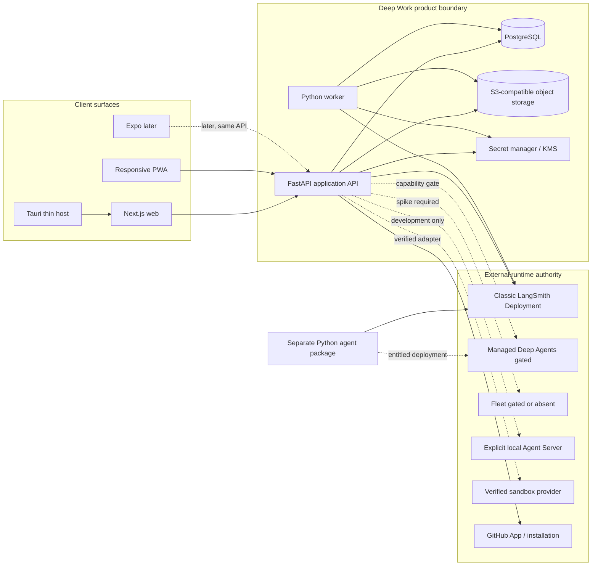
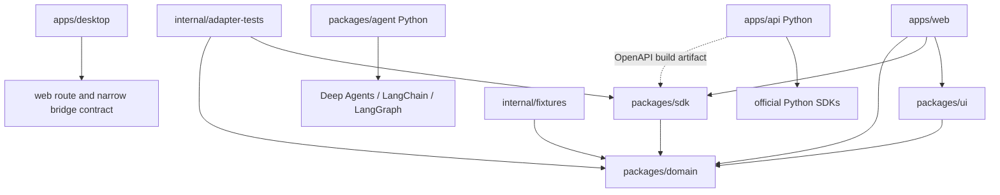
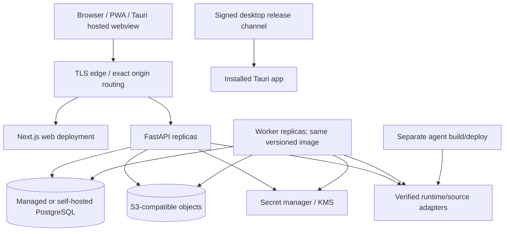

# Deep Work application architecture

> **Status:** this is the accepted application architecture. It authorizes the
> bounded credential-free scaffold in the active ExecPlan, not live-provider
> integration or a hosting vendor. Named external capabilities remain unavailable
> until their pinned-package/live-contract evidence is accepted.

## Recommendation in one page

Deep Work should be one web application with a Python application service, not a set of independently evolving clients and not a browser that talks directly to arbitrary agent deployments.

- **Backend:** Python 3.12, FastAPI, Pydantic v2, SQLAlchemy 2, Alembic, and PostgreSQL. One Python distribution initially exposes separate API and worker entry points. PostgreSQL owns durable product state and an outbox/job ledger. An S3-compatible object store owns application uploads and exports. A secret manager/KMS owns credential material.
- **Agent:** a separately packaged Python Deep Agents project. It uses LangChain and LangGraph public interfaces and can be deployed to a classic LangSmith Deployment without importing FastAPI, SQLAlchemy, browser-session, or application persistence concerns.
- **Runtime integration:** the Python service uses source-specific adapters built on pinned official Python SDKs. Classic LangSmith Deployment is the public v1 baseline. Managed Deep Agents is a capability-detected, private-beta adapter. Fleet remains absent unless a live spike proves read/invoke. The browser never receives source credentials or a server-only `authRef`.
- **Web:** Next.js 16, React 19, strict TypeScript, and the App Router. Next.js owns rendering, routing, and browser concerns; it is not a second business backend. Ordinary server state uses a query/mutation service. Active task streaming uses a separate normalized stream client and deterministic reducer.
- **Mobile v1:** the same complete responsive web product. It must complete the task, approval, artifact, and phone-landing journeys at 320 CSS pixels. Install/PWA/push capabilities enable only on browser cells accepted by `SPIKE-PWA-001`; ordinary responsive web and in-app state remain complete fallbacks. Offline is labelled, bounded, and read-only; mutations are never silently queued.
- **Desktop v1:** a thin Tauri v2 host around one exact trusted hosted web origin, gated by a platform qualification spike. Tauri provides only system-browser authentication handoff, deep links, tray, native notifications, secure bootstrap storage, and signed updates. It does not bundle Python or hold provider credentials.
- **Native mobile:** Expo is a later discovery hypothesis. It may reuse `packages/domain` and a proven platform-neutral generated/client core, but needs native auth, secure-storage, connectivity, stream, push, and lifecycle adapters. Whole browser-SDK or DOM reuse is not promised.
- **Repository shape:** keep separately testable Python packages and a pnpm/Turborepo TypeScript workspace. Add a pure `packages/domain` and synthetic language-neutral `internal/fixtures`; keep Python source-adapter standard tests with `apps/api` and TypeScript DTO/reducer/client conformance in `internal/adapter-tests`.

This split aligns contribution boundaries with the reference projects: typed and independently testable Python packages from Deep Agents/LangChain/LangGraph, and strict package-oriented TypeScript from LangChain.js, while allowing the product UI to use established Next.js conventions.

## 1. Architecture goals

1. **A complete product boundary.** Deep Work owns sessions, workspaces, source registrations, product preferences, audit, notification, and safe cross-source projections instead of relying on a nonexistent global runtime API.
2. **A faithful runtime boundary.** LangSmith/LangGraph sources remain authoritative for assistants or agents, deployments, threads, runs, checkpoints, interrupts, and traces. Deep Work keeps source-qualified references and bounded projections.
3. **One capability model, multiple adapters.** A source may be classic, MDA, local, or fixture, but UI code consumes one normalized capability manifest and deterministic fallbacks.
4. **Secrets stay server-side.** The browser, PWA service worker, React state, analytics, notifications, and Tauri webview never receive provider credentials or server-only credential references.
5. **One web product.** Desktop and mobile do not fork product logic. Responsive web is the primary client; Tauri hosts it and Expo, if later justified, consumes the same application contract.
6. **Contribution boundaries resemble LangChain projects.** Packages have explicit public APIs, local commands, type checking, unit/integration separation, standard adapter tests, examples, and narrow dependency direction.
7. **Failure is an explicit state.** Source degradation, partial fan-out, disconnect, stale projection, offline, permission loss, and worker lag never become blank screens or false success.
8. **Contracts are executable.** OpenAPI, normalized stream fixtures, source-adapter conformance, migration compatibility, and end-to-end scenarios are CI inputs rather than prose promises.
9. **Open-source operation is viable.** Fixture mode and a documented local classic deployment path work without private-beta access or paid provider credentials.
10. **Future clients do not force a rewrite.** The application API, domain identities, idempotency, pagination, and mobile-size payloads are designed before an Expo client is created.

## 2. Non-goals

- Reimplementing LangGraph Server, LangSmith control-plane APIs, the official deployment CLI, `mda deploy`, checkpoint persistence, tracing, or SDK stream-recovery logic.
- Public Fleet CRUD, invented `/v1/deepagents/*` routes, arbitrary MDA connector routes, or a global cross-source thread-search call.
- Running arbitrary source requests through a generic credentialed proxy.
- Direct browser-to-deployment streaming as a v1 requirement. It may be evaluated later only if an official, short-lived, least-privilege browser contract is documented and security-approved.
- Bundling a Python agent runtime, unrestricted shell, generic filesystem access, or provider credentials in the desktop client.
- Native mobile feature parity in v1, background agent execution on-device, or a separate mobile backend.
- Durable storage of every upstream token/event. Runtime sources retain their own authoritative history; Deep Work stores only product-required bounded projections and audit evidence.
- A generic workflow engine or Kubernetes-style control plane inside Deep Work.
- Choosing a cloud, auth, object-storage, push, or secret-manager vendor in this proposal.
- Treating prototype components as committed architecture or treating reference-repository internals as a supported external API.

## 3. Evidence and authority

### 3.1 Pinned local evidence

| Evidence | Local path and revision | Architectural use | Authority limit |
|---|---|---|---|
| Frontend prototype | `deep-work-frontend` at `8866d39a2888e358091208063693f260cff6d261` | Interaction, route, responsive, and component evidence | Not product scope, backend proof, or API authority |
| Official docs mirror | `langchain-docs-reference` at `7b9215d708e0b57e6fbae7b5d0762c4118b8e309` | Published LangChain, Deep Agents, LangGraph, and LangSmith behavior | Generated contracts and accepted live fixtures outrank prose when they differ |
| Canonical plan snapshot | `deepwork` at `06f051554bf938e919af5ab7855974098fbf3d2a` | Product intent and release constraints | Remains unchanged until this package is reviewed |
| Existing delivery plan | `docs/plans/2026-07-22-001-feat-deepwork-v1-delivery-plan.md`, preserved 957-line artifact | Prior sequencing and assumptions | Evidence only; unsupported contracts do not become architecture |
| Deep Agents code | `langchain-packages/deepagents` at `7794b61a6e76230e8c7a49bdce808b3728305914` | Python package shape, `uv`/Make/Ruff/typing/testing, middleware and partner boundaries | Source behavior, not a promise that beta interfaces are stable |
| LangChain Python code | `langchain-packages/langchain` at `592055e15e138f5369dce95dd049ce22430996e2` | Public API discipline, Pydantic/typing/tests, integrations | Product service architecture is still Deep Work-owned |
| LangChain.js code | `langchain-packages/langchainjs` at `ee76ea0347fb611153e5ec7d0e70fa405f5293a3` | pnpm/Turborepo, strict ESM, standard tests, package boundaries | Next.js application conventions may differ where framework rules require it |
| LangGraph code | `langchain-packages/langgraph` at `31f90df3e6b0268fa77fd2d118a917d420b84a68` | SDK and checkpoint package boundaries, stream controller behavior, conformance suites | Use public SDKs; do not import private controller internals |

High-value local examples include `langchain-packages/deepagents/AGENTS.md`, `langchain-packages/deepagents/libs/deepagents/pyproject.toml`, `langchain-packages/deepagents/libs/deepagents/deepagents/middleware/rubric.py`, `langchain-packages/langgraph/libs/sdk-py/langgraph_sdk/stream/controller.py`, `langchain-packages/langgraph/libs/checkpoint-conformance/`, and `langchain-packages/langchainjs/internal/standard-tests/`. They guide method and testing; they are not copied into Deep Work or treated as deployed API contracts.

### 3.2 Precedence rules

For Deep Work engineering practice, executable configuration and tests outrank manifests/generated artifacts, which outrank repository `AGENTS.md`, which outrank prose. For external runtime behavior, accepted live contract fixtures outrank installed public SDK/generated schema, which outrank official docs, which outrank reference internals and prototype assumptions.

If sources disagree, the affected capability is `unknown` and unavailable for mutation until a named spike records package/server versions, account tier, region, headers, request/response or stream fixtures, and deterministic fallback.

## 4. Logical architecture



### 4.1 Boundary rules

- Clients call Deep Work `/api/v1`; they do not assemble upstream authentication headers or call guessed provider routes.
- FastAPI is the product control point for authorization, tenant isolation, idempotency, capability checks, source adapter selection, response normalization, audit, and secret resolution.
- The worker executes accepted durable background work from the same application distribution. It does not become a second API or a substitute agent runtime.
- The separately deployable agent package defines Deep Work's starter agents, middleware composition, tool policies, and graph/runtime configuration. It does not import the product database or user-session code.
- External sources remain authoritative for runtime execution. Deep Work reconciles references and projections instead of cloning the runtime.
- Object storage contains application-owned bytes; sandbox and runtime files remain source-owned unless a verified transfer creates an explicit application artifact.
- Every outbound adapter is typed and allowlisted. There is no route taking arbitrary method, URL, headers, and body from a client.

## 5. Proposed repository and package graph

```text
deepwork/
├── apps/
│   ├── api/                 # Python distribution; API and worker entry points
│   ├── web/                 # Next.js 16 application and responsive PWA
│   └── desktop/             # Tauri v2 host, capabilities, packaging
├── packages/
│   ├── agent/               # Separate Python Deep Agents deployment package
│   ├── domain/              # Pure TypeScript identities, states, reducer contracts
│   ├── sdk/                 # Generated DTOs plus typed Deep Work API/stream clients
│   └── ui/                  # Reusable React primitives and composed shared controls
├── internal/
│   ├── fixtures/            # Synthetic fixture transcripts, seeds, scenario builders
│   ├── adapter-tests/       # TypeScript DTO/reducer/client conformance suites
│   ├── tsconfig/            # Shared strict TypeScript configuration
│   └── tooling/             # Narrow repository scripts; no product runtime imports
├── docs/
├── Makefile                 # Discoverable root fan-out commands
├── package.json             # pnpm/Turborepo workspace root
```

`packages/domain` is a required correction. Without it, either reusable UI imports a network SDK or domain identities are duplicated in every client. It contains no React, browser, Next.js, HTTP, generated OpenAPI, provider SDK, or secret-bearing types.

### 5.1 Dependency direction



Forbidden directions:

- `packages/domain` importing `packages/sdk`, React, Next.js, Tauri, or Python-generated runtime code;
- `packages/ui` importing FastAPI-generated DTOs, source adapters, or upstream LangGraph/LangSmith types;
- `packages/sdk` importing React hooks as its query/mutation implementation;
- `apps/api` importing UI packages or prototype fixtures;
- `packages/agent` importing `apps/api`, SQLAlchemy application models, session cookies, or tenant tables;
- `apps/desktop` forking routes, domain state, or provider integration;
- any browser package importing a type containing `authRef`, provider token, secret-manager key, or raw upstream authorization header.

The OpenAPI schema is the wire-contract source. `packages/sdk/src/generated` is generated and reviewed for drift; hand-written SDK services map DTOs into stable `packages/domain` values. Cross-language models are not manually kept “identical” by convention alone.

`packages/agent` is independently installable and uses an explicit public layout:

```text
packages/agent/
├── pyproject.toml
├── uv.lock
├── Makefile
├── README.md
├── langgraph.json               # reviewed graph target and deployment config
├── src/deepwork_agent/
│   ├── __init__.py              # deliberate public exports
│   ├── py.typed                 # typed-package marker
│   ├── graph.py                 # typed graph factory and deployment entry point
│   ├── config.py
│   ├── state.py
│   ├── prompts/
│   ├── tools/
│   ├── middleware/
│   └── templates/
├── tests/
│   ├── unit/
│   ├── contract/
│   └── integration/
└── evals/
    ├── datasets/
    └── graders/
```

The exact distribution/import/config names are accepted during scaffold review,
then pinned. The invariant is an explicit graph entry point, typed inputs/config,
public exports, captured contracts, and no import from `apps/api`.

## 6. Backend architecture

### 6.1 Why Python is the proposed application backend

Python is recommended because the highest-risk boundary is LangChain/LangGraph/Deep Agents integration, not rendering JSON. Python keeps the service close to official packages, type models, examples, contributors, and runtime semantics, while FastAPI provides a clear OpenAPI contract for TypeScript and future Expo clients. It also lets source contract fixtures exercise the same public SDK used by the service.

This does **not** put product HTTP/persistence code inside the agent. The application service and agent package are independently deployable, independently locked, and communicate only through supported deployment/runtime contracts.

### 6.2 Process topology

The initial `apps/api` Python distribution should expose two entry points from one versioned image:

| Process | Responsibility | Must not do |
|---|---|---|
| `deepwork-api` | HTTP/SSE, sessions, authorization, query/mutation use cases, short request-bound source calls, stream normalization, upload initiation, health/readiness | Run accepted durable jobs in `BackgroundTasks`, perform unbounded fan-out, own deployment execution, or store raw credentials |
| `deepwork-worker` | PostgreSQL job leases/outbox, reconciliation, notifications, webhook handling, source health refresh, upload scan/finalization, bounded retries | Serve browser traffic, hold a live UI stream as durable work, or turn source scheduling into an invented application scheduler |

Use the same distribution initially so models, migrations, ports, and policies cannot drift. Deploy API and worker as separately scalable processes. Split a worker package only after ownership, dependency, or scaling evidence makes the coupling harmful.

### 6.3 Hexagonal module layers

```text
apps/api/deepwork_api/
├── transport/        # FastAPI routes, SSE envelopes, auth middleware, webhooks
├── application/      # Use cases, transaction boundaries, authorization orchestration
├── domain/           # Pure entities, value objects, policies, errors, state transitions
├── ports/            # Protocols for sources, secrets, objects, jobs, notifications, clocks
├── adapters/
│   ├── persistence/  # SQLAlchemy repositories and unit of work
│   ├── sources/      # Classic, gated MDA/Fleet, local, fixture
│   ├── secrets/      # Secret manager/KMS implementation
│   ├── objects/      # S3-compatible implementation and scanner integration
│   ├── github/       # GitHub App/token broker
│   └── notify/       # Push/email/native hint providers
├── workers/          # Job handlers, outbox delivery, reconciliations
├── contracts/        # Pydantic request/response/event models and OpenAPI policy
└── bootstrap/        # Settings, dependency construction, API/worker entry points
```

Layer rules:

- `domain` imports only the standard library and deliberate type helpers. It has no FastAPI, SQLAlchemy, provider SDK, environment-variable, or network imports.
- `application` depends on domain and ports. Use cases accept an actor/workspace context explicitly and own authorization and transaction boundaries.
- `transport` validates untrusted input, converts it to application commands/queries, and maps typed failures. Routes do not contain provider SDK calls or business decisions.
- `adapters` implement ports. Source-specific SDK and header behavior never leaks into domain types or route handlers.
- SQLAlchemy models are persistence records, not response schemas. Pydantic contract models are explicit and cannot serialize a secret-bearing persistence object by accident.
- A generic `SourceAdapter` protocol describes Deep Work operations, not arbitrary HTTP. Optional operations are guarded by a capability manifest and conformance tests.
- Async I/O is the default for HTTP, source SDK, database, and object operations. CPU- or process-bound work runs in a bounded worker path.

### 6.4 Source adapter contract

The server-owned source record may include an opaque `authRef`; the public view must not.

```python
@dataclass(frozen=True, slots=True)
class AgentSourceRecord:
    id: SourceId
    workspace_id: WorkspaceId
    kind: SourceKind
    endpoint: ValidatedEndpoint
    assistant_identity: AssistantIdentity
    workspace_context: SourceWorkspaceContext | None
    auth_ref: CredentialReference
    capability_manifest: CapabilityManifest


class AgentSourceView(BaseModel):
    id: str
    display_name: str
    kind: SourceKind
    endpoint_label: str | None
    assistant: PublicAssistantIdentity
    credential_state: CredentialState
    capabilities: list[CapabilityEvidenceView]
    health: SourceHealthView
```

`CapabilityEvidenceView` carries capability name, state (`available`, `unavailable`,
`gated`, `permission-denied`, or `unknown`), observation time, adapter and contract
version, evidence classification, and a safe reason. A bare boolean cannot enable
a control. The exact names are illustrative and therefore proposed, not a frozen
public API. The required invariant is exact: secret values, exact operational
endpoint, and `authRef` are not in OpenAPI responses, client packages, analytics,
fixtures, or browser storage. An authorized source-native deep link is a separate
validated field, never a generic proxy target.

Each adapter must implement only normalized operations proved for that source, such as safe probe, list source-qualified threads, hydrate task, start run, cancel where verified, submit a complete ordered HITL batch, join/recover a stream, and obtain safe artifact metadata. Unsupported, permission-denied, unknown, and transient failure are separate results.

### 6.5 Classic, MDA, Fleet, and local posture

| Source | Architectural posture | Enablement | Deterministic fallback |
|---|---|---|---|
| Classic LangSmith Deployment | Supported public v1 baseline through pinned official SDKs | Accepted auth, thread/run, stream, HITL, and cancellation fixtures for the selected package/server pair | Capability-specific read-only state or polling/full hydration; source-native deep link |
| Managed Deep Agents | Private-beta adapter; CLI remains deployment authority | Entitlement detection plus `SPIKE-MDA-001`; only proved read/invoke/schedule/context capabilities | Classic deployment connection and MDA-unavailable explanation |
| Fleet | No default implementation | `SPIKE-FLEET-001` must prove supported public read/invoke, identity, headers, errors, and lifecycle | Omit Fleet controls; preserve documentary links only |
| Local Agent Server | Explicit contributor/development source | Loopback-only configuration, clear development banner, pinned contract | Synthetic fixture source |
| Fixture | Always available, network-denied | Versioned scenario pack | Reset fixture; never fall through to live |

Deep Work uses the public official SDK, not private files such as LangGraph's stream-controller implementation. The local controller is evidence that replay/dedup/reconnect concerns already exist upstream; it is a reason to pin and test the SDK rather than rewrite it.

## 7. Data and state ownership

### 7.1 Ownership matrix

| State | Authority | Deep Work persistence | Client persistence |
|---|---|---|---|
| Actor, session, device binding | Deep Work identity/application service | Actor reference, session metadata/hash, revocation, device audit | Secure HttpOnly session; desktop bootstrap only in OS secure storage |
| Org/workspace membership | Deep Work application service | Durable tenant and membership records | Current non-secret selection; reauthorized on every request |
| Source registration and capability evidence | Deep Work application service | Endpoint origin, assistant identity, workspace context, server-only credential reference, dated manifest, probe audit | Credential-free public view; optional bounded label cache |
| Provider credential material | Approved secret manager/KMS | Opaque reference and rotation state only | Never |
| Agent/assistant/deployment | Runtime source | Source-qualified identity, safe projection, app-owned draft/deploy audit where relevant | Current authorized projection |
| Thread/run/checkpoint/messages/interrupt | Runtime source | Source-qualified references, app task metadata, bounded projection/reconciliation cursor where approved | Active normalized state; explicitly stale safe cache only |
| Task title/archive/notification/application status | Deep Work application service | Durable metadata and audit | Query cache; safe draft preferences only |
| Runtime trace | LangSmith/runtime | Trace reference and qualified summary only | Authorized safe link/summary |
| Environment/snapshot/sandbox files | Selected sandbox/runtime | Source identity, lifecycle projection, policy/audit | Authorized metadata or streamed view, no secret token |
| User upload/attachment before transfer | Deep Work object store | Object metadata, quarantine/scan state, retention, task link | Local pre-upload selection and progress only |
| Application-generated export | Deep Work object store | Object metadata, authorization, expiry, audit | Short-lived authorized download |
| Runtime artifact | Runtime/sandbox unless explicitly copied | Metadata/provenance/link; copied object only through accepted transfer contract | Authorized view/download URL, never provider credential |
| Notification | Deep Work application service | Category, target opaque ID, state, delivery attempts, preference | In-app cache; push payload is a non-authoritative hint |
| Audit/security event | Deep Work application service | Append-only bounded record under retention policy | Safe correlation ID only |
| Fixture transcript | Versioned repository fixture | Synthetic seed/version | Bounded fixture state; never contains real secrets/content |

“No database” is therefore rejected for v1. Data minimization means storing only product-owned state and necessary projections, not eliminating durable state required for authorization, tenancy, idempotency, notifications, audit, and recovery.

### 7.2 PostgreSQL model boundaries

Every tenant-owned table carries a workspace or tenant key and every query starts from authorized context. Source-native IDs are never globally unique on their own; keys include `source_id`. Application task IDs are opaque Deep Work IDs mapped to source/thread/run identities through a typed relation.

Recommended application-owned record groups are:

- actors, sessions, devices, organizations/workspaces, and memberships;
- source registrations, credential references, capability manifests, probe history, and health;
- task shells, source-qualified runtime references, user title/archive state, templates, and local drafts where policy permits;
- agent configuration drafts, versions, validation results, deploy attempts, and activation audit;
- notification records, preferences, subscriptions, and delivery attempts;
- GitHub installation references, repository grants, and short-lived token-broker audit;
- uploads/exports/artifact metadata, scan state, retention, and authorization;
- idempotency keys, jobs, outbox messages, webhook receipts, reconciliation checkpoints, and audit/security events.

Do not persist raw provider tokens, generic upstream response bodies, unbounded token streams, sandbox secrets, GitHub installation tokens, or duplicated LangSmith trace payloads.

### 7.3 Objects and attachments

An S3-compatible API is the proposed abstraction; the vendor is deliberately undecided. Upload flow is direct-to-object-store through a short-lived, actor/workspace/object-bound grant. Objects begin in quarantine, have declared and detected media type, size/hash, malware/unsafe-content status, and retention policy, and cannot be transferred to a runtime until scan and `SPIKE-ATTACH-001` succeed.

The source adapter decides whether and how a clean object becomes runtime input. If the live contract is unknown, attachments are disabled for that source and bounded pasted text is the fallback. Download grants are short-lived, authorization is rechecked, filenames are untrusted display values, and active HTML/SVG or executable content is never rendered inline without a dedicated safe viewer policy.

## 8. API and stream boundaries

### 8.1 HTTP application contract

- `/api/v1` is the only product API consumed by first-party clients.
- FastAPI/Pydantic owns the reviewed OpenAPI document. CI generates the TypeScript transport layer and fails on unreviewed drift.
- Queries and mutations are separate operations with typed error envelopes, idempotency policy, authorization, and source capability checks.
- Collection responses use stable application pagination. Multi-source queries encapsulate per-source cursors and errors; they do not imply an upstream global cursor.
- Mutations accept explicit idempotency keys where retries can duplicate external effects. The server records outcome before returning a final success.
- Long-running accepted work returns an operation/job reference with a terminal state contract; a request timeout is not an operation result.
- Error responses distinguish validation, unauthenticated, forbidden, permission-denied upstream, unsupported capability, stale conflict, not found without existence leakage, rate limited, transient source failure, and internal failure.
- Next.js route handlers may perform narrowly scoped browser concerns such as auth callback or same-origin forwarding. They contain no product policy and cannot call provider SDKs with independent credentials.

### 8.2 Normalized task stream

For v1, clients subscribe to a Deep Work stream endpoint and the Python adapter consumes the verified official source SDK. This keeps credentials, source versions, redaction, capability decisions, and event normalization server-side.

The proposed application stream is server-to-client SSE for task events plus ordinary HTTP mutations for steering, cancellation, and HITL. A true terminal/PTY may add a separately authorized WebSocket only after `SPIKE-TERMINAL-001`; it does not change the general task transport.

The normalized envelope must preserve, rather than flatten:

- source-qualified task/thread/run/checkpoint identities;
- durable message and tool-call identity where supplied;
- event ordering and source namespace;
- action request and aligned review config arrays;
- one ordered HITL decision per action;
- subagent parent/namespace identity where proved;
- unknown event blocks as safe bounded generic events;
- replay/dedup metadata without pretending one resume protocol fits every source.

The React stream hook is presentation integration only. A framework-neutral stream client and deterministic reducer own connect, hydrate, replay, deduplicate, reconcile, and terminal state. Query/mutation services do not wrap or call React hooks.

### 8.3 Disconnect and resume

Closing a browser stream does not cancel a run. On foreground/reconnect, `/api/v1` authorizes current access and the adapter chooses the verified recovery path: protocol-v2 `since`, a verified legacy resume contract, official run join, or full hydration/polling. The browser does not construct `Last-Event-ID` for protocol v2 or persist a generic upstream cursor.

Any client resume token is opaque, short-lived, scoped to actor/workspace/source/task/run, and meaningful only to the application service. If replay expires or an instance is lost, full authoritative hydration is the fallback. Deduplication is tested against golden transcripts. A stream gateway crash changes latency, not runtime ownership or task completion.

### 8.4 HITL and control actions

Approvals are complete ordered batches. Deep Work preserves `actionRequests[]`, aligned `reviewConfigs[]`, editable argument schemas, and one decision for every action; it never submits only visible or locally modified entries. Stale interrupts return a conflict and current state. Exact resume syntax and allowed decision values remain blocked on `SPIKE-HITL-001`.

Cancel, retry, checkpoint branch, queue strategy, artifact/file operations, schedules, and deployment activation each require their owning capability and spike. No frontend control causes a guessed SDK method or route.

## 9. Worker, outbox, and consistency

PostgreSQL outbox and leased job tables are the proposed v1 durability mechanism. This avoids adding Redis/Celery before workload evidence while making accepted background work visible, retryable, and auditable.

### 9.1 Job classes

- notification fan-out and delivery-state reconciliation;
- source capability/health refresh using non-destructive probes;
- source thread/task projection reconciliation and stale-marker updates;
- verified webhook processing with deduplication;
- object malware scan/finalization and retention cleanup;
- deploy-operation polling after a verified public deployment action;
- GitHub/CI status reconciliation;
- audit retention and safe aggregation.

Live task token forwarding is request-bound streaming, not a durable job. Runtime execution stays upstream. Product schedules use the source's verified schedule model; the worker may reconcile evidence but cannot silently emulate unsupported source scheduling.

### 9.2 Delivery semantics

- Jobs are at-least-once; handlers must be idempotent or use an external idempotency key.
- A database state change and its outbox message commit in one transaction.
- Leases expire and can be reclaimed; attempts, next retry, terminal reason, and dead-letter review state are durable.
- Exponential backoff is bounded by job class. Authentication/permission failures do not retry indefinitely.
- External success followed by local timeout is reconciled using stable operation identity before another mutation is attempted.
- Queue depth, oldest age, retries, dead letters, and handler latency are release metrics.

A dedicated broker is an explicit later ADR if Postgres locking, throughput, scheduling precision, or independent service ownership misses accepted targets. It is not introduced as an unmeasured default.

## 10. Authentication, authorization, and tenancy

Three identities must remain separate:

1. **Deep Work actor/session** authenticates the person or client to the application.
2. **Source operator credential** authorizes Deep Work's trusted backend to a LangSmith/LangGraph/control-plane operation.
3. **Runtime end-user identity** is optional context passed only through a documented, verified runtime identity contract.

They are not interchangeable. An OAuth token valid for application sign-in is not assumed valid for control-plane, deployment, MDA, or runtime identity. API-key source connection is the unconditional fallback until `SPIKE-AUTH-001` proves exact OAuth audiences/scopes. `SPIKE-AUTH-002` pins each API-key/workspace header combination.

### 10.1 Browser and PWA

- Use secure, HttpOnly, same-site application sessions with CSRF protection for state-changing browser requests.
- CORS is an exact first-party origin allowlist. A same-origin reverse proxy is an infrastructure option, not a Next.js business backend.
- Workspace is derived from the authorized session and requested opaque ID; it is not trusted from an unverified header alone.
- Sign-out, workspace change, membership revocation, or session expiry purges protected browser caches, service-worker data, drafts according to policy, and push subscriptions as required.

### 10.2 Desktop

Tauri uses the system browser and a one-use, device-bound callback flow if `SPIKE-DESKTOP-001` validates it. OS secure storage may hold only a scoped, revocable application bootstrap/session token and device identifier. Raw source/GitHub credentials remain server-side. Hosted-origin cookies, callback grammar, origin restrictions, and revocation must be qualified on each OS before release.

### 10.3 Tenant model

The schema is team-compatible from day one even if the initial commercial experience is one user per workspace. Every application record and object is tenant-scoped, authorization happens before existence disclosure, cache keys include actor and workspace, and source IDs include the owning workspace. Initial roles can remain narrow; broad RBAC is a later product feature, not a reason to use a global tenant or omit membership records.

## 11. Frontend architecture

### 11.1 Next.js responsibilities

Next.js 16/React 19 is recommended because Deep Work needs authenticated routing, responsive web/PWA delivery, public onboarding/docs surfaces, streaming UI, metadata/deep links, and a hosted origin reusable by Tauri. It is a good client/rendering framework and a poor place to duplicate Python application policy.

Use the App Router with this split:

- server components for public pages, initial authenticated shell/bootstrap where safe, metadata, and low-interactivity layout;
- client components for task stream, composer, approvals, virtualized activity, command palette, files/diffs, and browser-only capabilities;
- route handlers only for narrow web transport/auth/download concerns, forwarding to `/api/v1` without a second source adapter or persistence model;
- no provider API key, `authRef`, source SDK, or arbitrary deployment fetch in a client bundle or Next.js route owned outside the API contract.

### 11.2 State model

| State class | Proposed owner | Rule |
|---|---|---|
| URL/navigation/filter state | App Router URL and route segments | Shareable/back-forward-safe where privacy permits |
| Server query/mutation state | `packages/sdk` service plus reviewed, exactly pinned TanStack Query v5 | No hand-written global loading booleans; invalidate by typed keys and source/task identity |
| Active stream projection | Framework-neutral stream client and deterministic reducer in domain/SDK boundary | Hydrate/replay/dedup/reconcile independent of React lifecycle |
| Local interaction/form state | Component/feature reducer | Promote only when two consumers need it |
| Composer draft | Explicit draft service under retention/privacy policy | Never imply dispatch; partition by actor/workspace/task/source |
| Preferences | FastAPI/Postgres when cross-device; local only when truly device-specific | No security or capability override in local storage |
| Offline read snapshot | Service worker/cache policy from `DW-SURF-001` | Bounded, stale-labelled, non-sensitive, no queued mutations |

DEC-042 proposes TanStack Query v5 for ordinary server state. It becomes canonical
only after review and an exact scaffold pin plus SSR/hydration, cancellation, cache
partition, and bundle check. It never owns active stream truth or an offline
mutation queue. A bespoke global state framework is not proposed for v1. React
context is limited to stable composition dependencies, not high-frequency token
streams.

### 11.3 Component ownership

- `packages/ui` contains tokens, primitives, accessible composites, status visuals, dialogs/sheets, virtualized-list foundations, and Storybook examples. It does not know FastAPI DTOs or LangGraph events.
- `packages/domain` contains opaque identities, capability/status types, normalized task events, reducers, selectors, and pure policies.
- `packages/sdk` contains generated OpenAPI transport, explicit query/mutation services, stream transport, DTO-to-domain normalization, and error classification. React bindings are optional leaf exports and never the only API.
- `apps/web/src/features` composes product journeys: inbox, composer, task detail, approvals, agent configuration, coding surfaces, schedules, activity, onboarding, and settings.
- Page/route modules assemble features and own route-level loading, empty, error, permission, stale, reconnect, and offline states.
- `apps/desktop` exposes a narrow typed capability bridge; web features remain complete when every native capability is false.

The prototype is migrated one feature at a time into these boundaries. No canonical package imports from `deep-work-frontend`, and prototype fixtures are replaced by synthetic contract fixtures before a surface is considered functional.

### 11.4 Information architecture

The proposed five primary destinations are Tasks, Approvals, Agents, Schedules, and Activity. Settings is an account/workspace utility route. Agent configuration lives with agent detail; project/environment configuration lives with its environment; deployment status is read-only until an explicit versioned deploy action. Desktop uses a rail; phone uses bottom navigation and contextual sheets. The route identity and capability disposition remain identical across breakpoints.

## 12. Web, desktop, PWA, and native mobile split

| Surface | Release posture | Reused layers | Surface-specific responsibility | Explicit limit |
|---|---|---|---|---|
| Desktop/large web | Primary v1 client | domain, SDK, UI, web features, API | Dense task workspace, side rails, multi-panel files/diff/activity | Cannot assume desktop-only actions for release completion |
| Responsive mobile web | Required v1 client | same web route/features/domain/SDK/UI | Bottom navigation, sheets, progressive detail, touch/keyboard, phone landing | No native background or secure-store assumption |
| Installable PWA | Progressive v1 enhancement | responsive web plus service worker/push adapter | Installation, safe shell cache, opaque push hints, foreground recovery | Not an offline runtime; no silent mutation queue |
| Tauri desktop | Gated v1 host | exact trusted hosted web origin, API, narrow bridge | Deep links, tray, native notifications, global shortcut if permitted, secure bootstrap, signed updater | No Python/runtime bundle, generic shell/filesystem, arbitrary navigation, or provider secret |
| Expo native | v2 discovery, not v1 | domain plus only the platform-neutral generated/client core proven by discovery | Native auth/stream/connectivity/navigation, secure storage, push/background features where justified | Does not assume the browser SDK is native-safe, reuse DOM UI, or create a separate backend |

### 12.1 Responsive contract

All v1 journeys—create, monitor, steer where supported, approve, cancel where supported, inspect artifact/diff, recover, and follow the phone landing flow—must work at 320, 375, 768, and desktop reference widths; portrait/landscape; 200% text zoom; reduced motion; keyboard; touch; and screen reader. A hidden desktop control requires a documented mobile equivalent, not disappearance.

### 12.2 PWA and offline contract

The service worker may cache immutable assets, the shell, and specifically approved bounded read projections. It excludes credentials, session endpoints, approval payloads, source auth, raw events, artifacts/files/diffs/tool outputs, and `no-store` data. Cold offline shows a safe connectivity state. Warm offline shows freshness and read-only status. Draft persistence is a separate explicit policy. Reconnect reauthorizes and rehydrates before enabling mutation. Backgrounding releases the client stream and never cancels the upstream run.

Push payloads contain opaque application identifiers and minimal lock-screen-safe copy. Selecting a push always reauthorizes and loads current state; it cannot approve, cancel, merge, or deploy from payload state.

### 12.3 Tauri host contract

The v1 proposal loads one exact trusted HTTPS origin. Navigation to provider pages, tool links, OAuth screens, arbitrary redirects, local network targets, `file:`, or `data:` is blocked in the privileged webview and opened in the system browser only through an allowlisted typed command. Tauri capabilities are least-privilege per window and platform. If remote-origin auth, service workers, stream recovery, accessibility, signing, or updater rollback fails `SPIKE-DESKTOP-001`, desktop is held and web/PWA ships.

### 12.4 Expo decision gate

Create `apps/mobile` only when evidence shows at least one requirement the qualified PWA/Tauri model cannot meet—such as reliable native push/background handling, distribution, camera/file capture, or mobile retention—and when mobile journey telemetry and contracts are stable. Expo consumes `/api/v1`, `packages/domain`, and only client-core/schema pieces proven platform-neutral; it supplies native auth, secure-storage, stream, connectivity, UI/navigation, notification, and lifecycle adapters. No whole-browser-SDK promise, DOM component sharing, WebView wrapper, or backend fork is proposed.

## 13. Deployment architecture



### 13.1 Deployable units

1. Next.js web/PWA artifact.
2. FastAPI image, run as API replicas.
3. The same FastAPI distribution/image, run as worker replicas.
4. PostgreSQL with migration, backup, restore, and point-in-time policy.
5. S3-compatible object storage and scanner integration.
6. Secret manager/KMS integration.
7. Independently deployed Python agent project to a supported runtime.
8. Signed/notarized Tauri artifacts and update metadata per supported OS.

No hosting vendor is selected. Deployment requirements are long-lived HTTP/SSE support, connection draining, exact-origin routing, private database/object/secret access, observable worker leases, migration jobs, encrypted backups, and signed release infrastructure.

### 13.2 Release and migration rules

- API and web support a documented compatibility window; incompatible clients receive a typed update-required response before mutation.
- Alembic migrations use expand/migrate/contract sequencing. A rollout never requires old and new application versions to interpret one column incompatibly.
- Migrations run as an explicit release job, not opportunistically in every API process.
- API shutdown drains streams without pretending runs are cancelled. Clients reconnect through the Deep Work application stream and hydrate; FastAPI alone selects the verified upstream adapter path.
- Worker deployments stop leasing, finish or surrender bounded work, then restart. Lease expiry enables recovery.
- Source adapters and normalized fixtures are versioned. An upstream SDK/server upgrade disables affected readiness until conformance passes.
- Tauri updater artifacts and metadata are signed, channel/architecture/version constrained, and rollback-qualified before promotion.

## 14. Local development and fixture mode

The first contributor path must work without private-beta accounts or real credentials.

### 14.1 Two named fixture modes

The browser-local **UI harness** renders components, routes, states, and responsive
fixtures without FastAPI or Postgres. It is fast feedback for presentation work,
not product integration proof.

The API-backed **product demo** starts FastAPI, worker, Postgres, object service,
web, and development telemetry using the fixture source adapter. It is the
end-to-end contributor/demo authority for persistence, jobs, stream recovery,
objects, security boundaries, and fixture/live parity. Worktree tooling gives each
demo distinct safe ports, database/schema, object prefix, browser origin/storage,
telemetry namespace, and proof directory.

### 14.2 Local topology

- root `make dev` (final command name subject to conventions review) starts Next.js, FastAPI, worker, PostgreSQL, and an S3-compatible development implementation;
- fixture mode is the default product source and denies outbound network access in tests;
- an explicit local Agent Server can be selected after the contributor opts in and its package/server contract passes;
- seed actors/workspaces/sources are synthetic and resettable;
- local TLS/deep-link/push/Tauri testing uses named qualification scripts rather than silently weakening production origin policy;
- each independently deployable Python package retains its own `pyproject.toml`, lock, Makefile, tests, and README, while root commands fan out.

### 14.3 Fixture parity

`internal/fixtures` provides versioned scenario transcripts for loading, empty, streaming, tools, reasoning, todos, complete ordered HITL, stale interrupt, subagent, artifact, cancellation race, reconnect/replay, source degradation, partial multi-source failure, malformed/untrusted content, long-thread virtualization, offline, and permission loss.

The same domain reducer, UI projections, and adapter conformance assertions run against fixture and live-normalized transcripts. Fixture mode has an unmistakable banner, never calls a live source if a fixture is missing, and cannot contain copied production prompts, repository content, deployment IDs, actor data, trace IDs, or secrets.

Redacted, versioned language-neutral transcripts and schemas live in
`internal/fixtures`. Python standard tests under `apps/api/tests/contract/sources`
exercise every source adapter against the same operation/state/error suite, with
source-specific tests only for declared capabilities. `internal/adapter-tests`
uses the same corpus for TypeScript generated-transport, DTO mapping, reducer, and
client conformance. Live tests are opt-in and credential-gated; unit/fixture tests
are socket-disabled.

## 15. Observability and operations

### 15.1 Correlation and telemetry

Every request, job, source call, stream session, webhook, and object operation carries a Deep Work correlation ID plus safe source/task/run references where authorized. Structured logs and traces identify adapter kind/version, capability fixture version, latency, retry, and classification without recording raw provider credentials, prompt/message content, tool arguments/results, file contents, HITL edits, signed URLs, or upstream bodies by default.

Required operational signals include:

- API rate, latency, error classification, saturation, open SSE sessions, disconnect/recovery path, and hydration time;
- source call latency/error/permission/unsupported/unknown by adapter and operation;
- stream duplicate/drop/reorder/reconcile counts against expected durable state;
- database pool/lock/migration/replication/backup health;
- worker queue depth, oldest job, leases, retries, dead letters, and outbox delivery lag;
- object quarantine, scan time/failure, retention, transfer, and download authorization failures;
- notification enqueue/delivery/revocation and deep-link authorization outcome;
- client version, PWA update/reconnect, desktop host/updater health, and safe crash telemetry.

### 15.2 Health endpoints and source status

Liveness proves only process progress. Readiness verifies required local dependencies without making destructive upstream calls. Source health is an application query with last-success, evidence version, freshness, and degradation reason; one source outage cannot fail global readiness or hide healthy sources.

LangSmith trace links are exposed only when authorized and verified. Product observability cannot depend exclusively on the same external runtime it is diagnosing.

## 16. Security architecture

Release-blocking controls include:

- tenant-context authorization before every lookup/mutation/object grant and explicit cross-tenant negative tests;
- server-side credential broker with encryption, rotation, least privilege, audit, and no browser-visible `authRef`;
- strict source endpoint validation and SSRF defenses covering DNS rebinding, redirects, private/link-local/metadata ranges, method/path/content limits, and response-size/time bounds;
- exact browser/Tauri origins, CSP, trusted types/safe rendering policy, no raw HTML for upstream content, and sandboxed viewers for untrusted artifacts;
- upload quarantine, type/hash/size checks, malware scanning, safe filenames, range/expiry policy, and authorization on every download;
- webhook signature, timestamp/replay protection, idempotency, and source/workspace binding;
- rate and concurrency limits by actor/workspace/source/operation, including stream and fan-out limits;
- CSRF, exact CORS, secure cookies, session rotation/revocation, and protected cache purge;
- Tauri least-privilege capabilities, typed commands, strict navigation/deep-link grammar, signed/notarized builds, and updater verification;
- dependency lock and provenance checks, secret scanning, SAST, container/filesystem minimization, and reproducible release evidence;
- redaction tests proving logs, traces, analytics, push payloads, crash reports, OpenAPI, and fixtures contain no secret or private raw content;
- a threat model and abuse cases for arbitrary agent/tool output, prompt injection into operators, egress, GitHub token brokerage, approval spoofing, and confused-deputy source actions.

## 17. Failure, recovery, and offline state matrix

| Condition | Required behavior | Recovery owner | Forbidden behavior |
|---|---|---|---|
| API cold start | Stable client loading state; readiness stays false until required local dependencies are safe | Platform/API | Accepting mutations before migrations/config are compatible |
| PostgreSQL unavailable | Fail closed for auth/mutations; retain only explicitly safe stale client state | Platform | Falling back to an in-memory production database |
| Object store unavailable | Text-only work remains available; upload/download explains degradation | API/platform | Marking attachment accepted or losing object provenance |
| Secret manager unavailable | Existing unauthenticated public shell may load; source calls/mutations fail closed | API/security | Reading secret copies from client or logs |
| One source unavailable | Healthy sources remain usable; affected records are stale-labelled | Source adapter | Global blank/error or cross-source cursor corruption |
| Multiple-source fan-out partial failure | Return successful groups plus per-source errors and independent retry | API/SDK | Presenting incomplete results as globally complete |
| Source permission revoked | Disable affected operation, purge unsafe cached detail, retain authorized provenance | API/source admin | Reclassifying permission-denied as unsupported or retrying forever |
| Capability manifest stale | Permit only policy-approved safe reads; require re-probe for risky mutations | API/source adapter | Optimistic feature enablement |
| Stream disconnected | Show reconnect; upstream run continues; recover through verified path | SDK/API | Treating disconnect as cancellation or replaying mutation |
| Replay expired/unknown cursor | Full authorized hydration/polling and deterministic reconciliation | API/source adapter | Guessing `Last-Event-ID` or dropping history silently |
| Duplicate/out-of-order event | Reducer deduplicates/reconciles against durable identity/state | Domain/SDK | Rendering duplicate approvals/tools or changing decision order |
| API replica drains/crashes | Client reconnects; runtime remains authoritative | Platform/SDK | Coupling runtime lifetime to SSE socket |
| Worker lag | UI shows operation pending with age; alert on threshold | Worker/platform | Synchronous false success or invisible backlog |
| Job repeated | Idempotent handler/reconciliation produces one external effect | Worker/adapter | Blindly repeating deploy/notify/source mutation |
| External success/local timeout | Query by stable operation identity before retry | Worker/API | Creating a second run/deploy/PR without reconciliation |
| Stale HITL interrupt | Reject batch with conflict and hydrate current interrupt | API/SDK | Partial or reordered decision submission |
| Attachment scan fails | Quarantine remains; dispatch excludes object; user gets safe retry/remove | Object adapter | Passing unscanned bytes to source |
| PWA cold offline | Connectivity explanation; no protected content or mutation | Web/PWA | Fake live state or credential cache |
| PWA warm offline | Bounded stale-labelled read state and draft policy; mutation disabled | Web/PWA | Silent background mutation queue |
| Mobile app backgrounded | Release client stream; keep server work independent | Web/PWA | Cancelling run or relying on continuous JS execution |
| Tauri hosted origin unavailable | Native safe connectivity screen and browser fallback | Desktop | Arbitrary navigation field or bundled stale privileged app |
| Desktop callback invalid/replayed | Reject, clear transaction, restart sign-in | Desktop/API | Accepting callback without state/device binding |
| Push denied/expired | In-app notifications remain complete; update subscription state | Web/API | Making push a prerequisite or approving from stale payload |
| Client/API incompatible | Read-only/update-required state before unsafe mutation | Web/API/desktop | Best-effort request with unknown schema |
| Migration failure | Stop rollout, keep compatible version, restore/repair through runbook | Platform | Destructive reset or partial schema claim |
| Malformed/hostile upstream content | Size/depth/schema bound, safe generic projection or rejection | API/SDK/UI | Raw HTML/script execution or unbounded render |
| Offline source recovery after auth change | Reauthorize, purge prior protected cache, then hydrate | API/client | Showing data under previous actor/workspace |

Every recovery action has a correlation ID and current freshness. Retries are explicit unless the operation is proven safe and idempotent. “Unknown” never becomes “success.”

## 18. Performance and scaling posture

The v1 architecture favors measurable simplicity:

- horizontally scale stateless API replicas; keep session/product state in PostgreSQL and secrets in the broker;
- keep source fan-out bounded per request and paginate per source;
- stream only the active task; release inactive subscriptions and virtualize long timelines;
- place normalization and redaction before bytes enter client caches;
- use bounded projections and reconciliation rather than a second full event store;
- scale workers separately from API and partition leases by job class if needed;
- avoid Redis/message broker until connection, lock, queue, or latency evidence requires one;
- test mobile payload, hydration, and interaction budgets as release criteria, not desktop-only averages;
- keep Next.js server rendering for stable shell/pages; avoid forcing high-frequency task streams through server-component rerenders.

Proposed initial targets require product review: p95 ordinary API response under 500 ms excluding named upstream latency, visible stream update under 250 ms after gateway receipt, mobile shell interactive under the accepted performance budget, zero duplicate user-visible events, and no unbounded client/API memory growth in the long-thread fixture.

## 19. Tradeoffs and rejected alternatives

| Decision | Benefit | Cost/risk | Rejected or deferred alternative |
|---|---|---|---|
| Python application backend | Best alignment with official agent/runtime packages and contributor expertise; strong typed OpenAPI boundary | Mixed-language monorepo and generated-client discipline | TypeScript-only backend: simpler language count but weaker direct alignment at highest-risk source boundary |
| Separate agent package | Keeps deployable agent portable and runtime-idiomatic | Two Python distributions/locks and contract tests | One FastAPI+agent package: leaks product persistence/session concerns into runtime artifact |
| Next.js web/PWA | Productive routing/rendering/PWA ecosystem and hosted origin for Tauri | Server/client boundary complexity and bundle discipline | Vite SPA: simpler client build but less useful for hosted shell/auth/public surfaces; revisit only if App Router adds no value |
| FastAPI as product API, thin Next handlers | One policy/secret/data authority | Extra network boundary if poorly routed | Next.js BFF with duplicated business logic/provider calls: rejected |
| Server-brokered normalized stream | Keeps credentials/contracts/redaction server-side and unifies sources | API connection/load and recovery complexity | Direct browser-to-source: deferred until official least-privilege browser contract exists |
| SSE plus HTTP mutations | Fits server-to-client task events and reconnect semantics | True PTY requires another transport | Universal WebSocket: unnecessary bidirectional authority and harder infrastructure; gated for terminal only |
| PostgreSQL outbox/jobs | Durable, transactional, fewer services for v1 | Not ideal for extreme throughput/precision scheduling | Redis/Celery/Kafka at inception: deferred pending evidence |
| S3-compatible application object store | Explicit upload/export security and portability | New lifecycle/scanning system | Runtime-only files: cannot own pre-dispatch uploads, exports, and cross-source app artifacts safely |
| Responsive web first, qualified PWA cells | One complete v1 mobile experience and faster parity | Platform limits for background/push/native UX | Expo in v1: duplicates navigation/UI before requirements stabilize |
| Tauri trusted remote-origin host | One live web product and small native surface | Remote-origin/auth/service-worker qualification risk | Bundled frontend/local Python: larger release/security/offline scope; browser-only remains fallback |
| Pure TypeScript domain package | Prevents UI↔network coupling and enables later Expo | DTO-to-domain mapping layer | SDK owns all domain types: makes reusable UI/client logic depend on transport |

## 20. Accepted architecture decisions

These decisions are canonical. “Contract-gated” means the architecture and safe
fallback are accepted while the affected capability remains disabled.

| ADR | Decision | Status in this package | Verification before implementation |
|---|---|---|---|
| ARCH-001 | Python 3.12 FastAPI/Pydantic/SQLAlchemy/Alembic/PostgreSQL application service | Accepted; aligns `DEC-002` | Package skeleton, async DB/migration, OpenAPI, deployment smoke |
| ARCH-002 | Separate Python Deep Agents package | Accepted; aligns `DEC-003` | Clean wheel/install and classic deployment smoke using public APIs |
| ARCH-003 | Next.js 16/React 19 App Router for web/PWA | Accepted; aligns `DEC-004` | Streaming vertical slice, bundle/performance/a11y qualification |
| ARCH-004 | Add pure `packages/domain` and keep SDK transport-specific | Accepted | Dependency-boundary lint and generated DTO mapping spike |
| ARCH-005 | Browser uses FastAPI `/api/v1`; no direct source secrets or generic proxy | Accepted security invariant | Threat model, OpenAPI secret scan, cross-tenant/SSRF tests |
| ARCH-006 | Classic deployment adapter is the v1 baseline; MDA/Fleet gated | Accepted; aligns `DEC-001` | Named source/auth/stream/HITL spikes; MDA/Fleet independently gated |
| ARCH-007 | API and worker entry points share one distribution/image initially | Accepted initial direction | Job/outbox load, shutdown, migration, and deploy topology spike |
| ARCH-008 | PostgreSQL outbox and leased jobs; no broker initially | Accepted initial direction | Contention/retry/recovery test against accepted workload |
| ARCH-009 | S3-compatible object abstraction for app-owned uploads/exports | Accepted abstraction; vendor deferred | Attachment/object security and transfer spike |
| ARCH-010 | Normalized SSE task stream plus HTTP mutations | Accepted application contract; source recovery gated | Protocol-v2/legacy/join golden transcripts and proxy timeout tests |
| ARCH-011 | Responsive web is complete v1 mobile; install/PWA/push are qualified enhancements | Accepted; aligns `DEC-006` | Browser/device, offline, push, a11y, and journey qualification |
| ARCH-012 | Tauri v2 exact remote-origin thin host | Accepted design; contract-gated; aligns `DEC-005` | `SPIKE-DESKTOP-001` on every supported OS; hold desktop on failure |
| ARCH-013 | Expo may consume domain and a proven platform-neutral client core later; no whole-SDK or DOM UI sharing | Deferred v2 brief | Evidence of unmet native requirement and stable mobile API profile |
| ARCH-014 | TanStack Query for ordinary server state; dedicated stream reducer | Accepted direction; exact pin deferred to scaffold ADR | SSR/hydration/cache partition/cancel/bundle proof |
| ARCH-015 | Team-compatible tenant schema with narrow initial roles | Accepted | Authorization matrix and cross-tenant negative suite |

An ADR cannot move to accepted merely because code was written. Review records rationale and consequences; contract-gated ADRs additionally require accepted fixtures in the source ledger.

## 21. Delivery milestones and exit gates

### A0 — Architecture acceptance and contract harness — Wave 0 complete

- Review the staged ADRs, package graph, ownership matrix, threat model boundary, and source precedence.
- Add reference-code pins to the source ledger and name owners for each required spike.
- Define OpenAPI compatibility, source-adapter conformance, normalized fixture, and secret-redaction checks.

**Exit:** architecture ADRs are explicitly accepted/amended; no implementation choice is hidden in a `ready` plan; classic contract spike harness can run without UI.

### A1 — Repository and local foundation

- Create package skeletons and dependency-boundary rules.
- Run FastAPI, worker, PostgreSQL, object emulator, Next.js, and fixture source through one documented contributor command.
- Establish synthetic seeds, socket-disabled unit tests, generated OpenAPI diff, and package-scoped commands.

**Exit:** a clean clone reaches fixture inbox/task/approval states with no real credential; Python wheels and TypeScript packages install/build independently; forbidden dependency tests pass.

### A2 — Identity, tenancy, persistence, and safe objects

- Implement application sessions, workspace/membership context, migrations, source registry, credential-reference port, idempotency, audit, object quarantine, and outbox/job ledger.
- Complete cross-tenant, CSRF/CORS, SSRF, secret-redaction, migration rollback, and backup/restore evidence.

**Exit:** two tenants cannot observe each other's IDs, cache, objects, sources, or errors; no public schema contains `authRef`; accepted job survives API restart exactly once at the effect boundary.

### A3 — Classic source vertical slice

- Accept source/auth/thread/stream/HITL/cancel fixtures for one pinned classic package/server pair.
- Implement classic adapter, source-qualified task projection, normalized stream, hydration/reconnect, complete HITL batch, and capability fallback.
- Keep MDA/Fleet flags false unless their own spikes pass.

**Exit:** one live classic task can be created, streamed, disconnected, resumed/hydrated, approved as an ordered batch, and reconciled without duplicate events or exposed credentials.

### A4 — Complete responsive web and PWA

- Port journeys from prototype evidence into domain/SDK/UI/feature boundaries.
- Complete five-destination IA, loading/empty/error/offline/permission/stale/mobile states, safe artifact flows, service worker, and in-app notification fallback.
- Qualify 320/375/768/desktop, keyboard, screen reader, reduced motion, long thread, and untrusted content.

**Exit:** executable v1 web/mobile journey scenarios pass in fixture and classic modes; install/push claims ship only on qualified platforms; offline never accepts a mutation.

### A5 — Desktop qualification and release

- Run remote-origin auth, navigation, service-worker, stream, deep-link, notification, tray, shortcut, accessibility, signing, updater, and rollback matrix.
- Ship only qualified platforms and capabilities; maintain browser fallback.

**Exit:** `SPIKE-DESKTOP-001` evidence is accepted per platform, malicious navigation/deep links fail closed, and updater rollback does not corrupt session or application state. Otherwise desktop remains held without blocking web/PWA.

### A6 — Gated adapters and future native discovery

- Evaluate MDA/Fleet independently through named fixtures; enable only proven operations.
- Review mobile telemetry and unmet platform needs before creating Expo packages.

**Exit:** capability manifests truthfully reflect entitled sources; no beta assumption enters baseline; an Expo ADR exists only if native value exceeds added maintenance.

## 22. Executable architecture acceptance scenarios

Each scenario must be automated at the lowest useful layer and included in an end-to-end release suite where user-visible.

1. **Clean fixture start:** Given a clean clone with no provider credentials, when the documented development command runs, then web, API, worker, database, object development service, and fixture source become ready and a seeded task journey completes without network access.
2. **Package boundaries:** Given the repository graph, when dependency-boundary checks run, then domain imports no React/network/framework code, UI imports no SDK/generated/provider types, agent imports no application persistence, and browser bundles contain no Python/provider secret type.
3. **OpenAPI generation:** Given an API contract change, when CI generates `packages/sdk`, then an uncommitted diff fails and a reviewed compatible change maps into a stable domain type.
4. **No credential exposure:** Given a source record with a real test `authRef` and secret, when every public API, OpenAPI document, log, trace, fixture, client cache, and error path is exercised, then neither value appears.
5. **Cross-tenant denial:** Given two workspaces with colliding source-native thread IDs, when either actor queries task, stream, object, deep link, or operation IDs from the other, then authorization fails without existence/content leakage.
6. **SSRF rejection:** Given endpoints resolving to loopback in hosted mode, private/link-local/metadata ranges, a redirect to them, or DNS rebinding, when source registration/probe runs, then no prohibited request is sent and a sanitized audited error is returned.
7. **Classic task lifecycle:** Given the accepted classic fixture, when a user creates a task, then the API records one app task/source/thread/run relation and the client renders normalized durable state without a direct browser source call.
8. **Stream disconnect:** Given an active run, when the SSE connection and API replica terminate, then the upstream run continues, the client reconnects through the accepted adapter path, and the final projection contains every durable event exactly once.
9. **Expired replay:** Given a resume cursor outside its supported window, when the client reconnects, then the API performs full authorized hydration/polling and reaches the same final state without guessing a legacy header.
10. **Ordered HITL:** Given repeated action names with aligned `actionRequests[]` and `reviewConfigs[]`, when the user edits and submits decisions, then one ordered decision exists per action, the complete batch is sent once, and a stale batch is rejected and refreshed.
11. **Unknown capability:** Given a source with `unknown` cancel or schedule capability, when the user opens the related surface, then mutation is absent/disabled with a deterministic fallback and no guessed SDK method or route is called.
12. **Partial source failure:** Given three sources where one times out and one loses permission, when inbox aggregation runs, then healthy results render, each failed source has the correct independent state/retry, and no global cursor or success count claims completeness.
13. **Idempotent accepted work:** Given a notification or deploy-poll job committed with its outbox event, when the worker crashes after external success but before local acknowledgement, then recovery reconciles one external effect and one terminal local result.
14. **Attachment quarantine:** Given a selected file with misleading type and a failing scan, when upload completes, then it remains quarantined, cannot be transferred/rendered, and safe text-only task dispatch remains available.
15. **Mobile journey parity:** Given a 320 CSS-pixel viewport, 200% text zoom, screen reader, reduced motion, and touch input, when a user creates, monitors, approves, inspects an artifact/diff, and recovers a task, then every desktop-required action has an operable labelled mobile equivalent with stable focus.
16. **Warm offline PWA:** Given an approved cached read projection and draft, when the network disappears, then content is stale-labelled, protected excluded content is absent, mutation is blocked, and reconnect reauthorizes before hydration or dispatch.
17. **Push as hint:** Given a stale or unauthorized push target, when selected, then the payload performs no mutation, current authorization is checked, and the user sees current state or a safe denial.
18. **Tauri navigation isolation:** Given malicious task content linking to an arbitrary origin, local file, custom scheme, or private address, when selected in Tauri, then the privileged webview does not navigate or invoke an unrestricted native command.
19. **Desktop host outage:** Given the trusted hosted origin is unavailable, when Tauri starts, then it shows a safe native connectivity/browser-fallback state without provider content, arbitrary URL entry, or bundled Python fallback.
20. **Signed updater failure:** Given invalid updater signature/checksum or interrupted download, when an update is attempted, then the installed signed version remains operable and no unsigned/partial artifact executes.
21. **Client/API compatibility:** Given an older web or desktop client outside the supported contract window, when it attempts a mutation, then it receives typed update-required state before any external effect.
22. **Hostile event:** Given a malformed, oversized, deeply nested, or HTML/script-bearing upstream event, when normalization/rendering runs, then bounds and schema policy produce a safe generic/rejected state without script execution, secret reflection, or unbounded memory.
23. **Source credential revocation:** Given an active registration whose source credential is revoked, when health or an operation detects it, then that source becomes degraded, unsafe mutations stop, history/provenance remains, and other sources continue.
24. **MDA/Fleet gates:** Given no accepted MDA entitlement fixture and no accepted Fleet read/invoke fixture, when production source types and routes load, then classic/fixture are available, MDA is explanatory or absent, and Fleet management controls/routes do not exist.
25. **Agent portability:** Given `packages/agent` built as a clean artifact, when installed and deployed with the supported public flow, then it imports no Deep Work web/API/database package and executes its smoke/evaluation suite against the pinned runtime.
26. **Migration compatibility:** Given old and new API/worker replicas during rolling deploy, when the expand migration and traffic run, then both versions serve compatible reads/writes; contract cleanup occurs only after the old version is gone.

## 23. Readiness checklist

The architecture is accepted when these invariants remain true:

- The backend, agent, web/PWA, desktop, and future mobile responsibilities have one owner each and no hidden second backend.
- The package graph includes `packages/domain`, fixtures, adapter tests, and enforceable forbidden dependencies.
- The state matrix names one authority for every durable or cached record, including credentials, uploads, runtime state, projections, notifications, and audits.
- No client contract can expose `authRef`, provider credentials, generic forwarding headers, or arbitrary source requests.
- Classic is the public baseline; MDA/Fleet/local are independently gated and have deterministic fallbacks.
- The official SDK is used through public interfaces; reference internals guide tests but are not copied as unsupported contracts.
- Query/mutation, task stream, worker job, and runtime execution lifecycles are distinct.
- PWA offline, push, and Tauri native behavior cannot mutate from stale payload/cache state.
- Every unverified external behavior has a named spike and every proposed implementation choice has an ADR/review gate.
- The 26 architecture scenarios map into feature-level executable acceptance suites.

Wave 1 may implement the credential-free scaffold. A dependent live capability is
not implementation-ready until its required spike passes or its accepted fallback
is the explicit shipped behavior.
