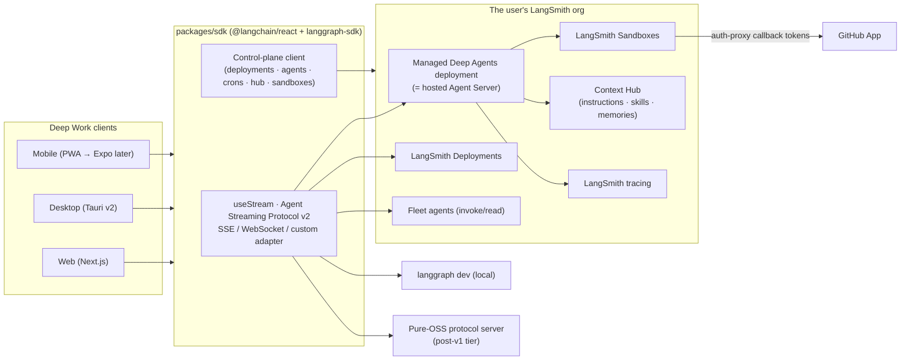

# 02 · Architecture

*Deep Work planning docs · 2026-07-21. Package versions and API facts verified against live sources on this date; see [research digest](../research/README.md).*

## 1. System overview



Deep Work is three things: **an agent** (`packages/agent`, a deepagents project deployable to any runtime tier), **a client** (apps over one shared SDK layer), and **a thin glue service** (Next.js server routes for OAuth callbacks, key-proxying, and push fan-out — no database of its own in v1).

## 2. Runtime tiers — one client over every rung

All tiers expose the same Assistants/Threads/Runs API and the open Agent Streaming Protocol (CDDL-specified, MIT `@langchain/protocol`). The client is written once against `useStream` and a control-plane client; tiers differ only in transport config and available features.

| Tier | What it is | Access | v1? |
|---|---|---|---|
| **Managed Deep Agents** (primary target) | Hosted runtime for code-first deepagents; private beta, US LangSmith Cloud. `mda deploy` compiles the project and creates a control-plane deployment (`source=internal_source`, `deployment_type: managed_deep_agent`); runtime owns backend/store/checkpointer/memory/skills/system-prompt. | Standard Agent Server API at the deployment URL; identity via `trusted_backend` headers or `validated_token` (JWKS/OIDC/Supabase/guest tokens); custom routes via the connector protocol (`/connectors/...`) | ✅ |
| **LangSmith Deployment** | Classic hosted Agent Server from a `langgraph.json` project (github / tarball / docker source). Serverless or Dedicated; Plus plan includes one free Serverless Small. | Agent Server API + full control-plane CRUD (`/v2/deployments`) | ✅ |
| **Fleet agents** | No-code deep agents on Agent Server. Create/update API not public (only `GET/PUT /v1/agent-builder/integrations`); invoke/read is public and owner-gated. | LangGraph SDK/REST with PAT + `X-Auth-Scheme: langsmith-api-key` | ✅ invoke/read |
| **Local dev** | `langgraph dev` (langgraph-cli, MIT + Elastic-2.0 in-mem runtime). No API key, no license check, state in `.langgraph_api/`. | Same API on localhost | ✅ |
| **Pure OSS self-host** | Custom Agent Streaming Protocol server (deployment-cookbook pattern: `POST /threads/:id/commands`, `POST /threads/:id/stream`, state routes) + MIT Postgres checkpointer; or Aegra (Apache-2.0 Agent-Server reimplementation). Loses double-texting strategies, crons, webhooks, assistants versioning, resumable joins. | Custom `AgentServerAdapter` in `useStream` | 🔜 designed-for, post-v1 |

**Design rule that makes this work:** the agent definition stays *runtime-agnostic* — no backend/store/checkpointer configured in agent code (MDA forbids it; the other tiers provision it). This is also exactly what keeps the agent Fleet-export-compatible.

**Licensing boundary (important for the OSS story):** everything Deep Work links against is MIT (`deepagents`, `langgraph`, `langgraph-sdk`, `@langchain/react`, `langgraph-cli`, `langsmith` SDK). Elastic-2.0 applies only to the Agent Server runtime itself (`langgraph-api`) — which Deep Work *talks to*, never redistributes. Production self-hosting of Agent Server requires an Enterprise license key; that's why the post-v1 OSS tier targets a protocol-server reimplementation instead.

## 3. The Deep Work agent (`packages/agent`)

A valid `mda` project root (also deployable via `langgraph.json` to classic tiers):

```
packages/agent/
  agent.py            # exports `agent` from define_deep_agent(...)
  instructions.md     # system prompt → synced to Context Hub per deployment
  tools/              # curated tool set (~15, open-swe-style)
  middleware/         # steering queue, auto-PR, tool-error handling
  connectors/
    mcp.py            # define_mcp_servers (remote HTTP/SSE, bearer)
    deepwork.py       # connector http(ctx) hook → /connectors/deepwork/* routes
  schedules/          # define_schedule(...) → reconciled as Agent Server crons
  skills/<name>/SKILL.md
  sandbox/
    __init__.py       # define_sandbox(LangSmithSandbox, scope="thread", ...)
    setup.sh          # environment provisioning (Codex-style)
  identity.py         # define_identity(preset="multi-tenant-saas" | "private-assistant")
```

Composition follows the open-swe v2 playbook — **compose on the harness, don't fork it**:

- **Model**: `provider:model` strings + harness profiles (Anthropic/OpenAI/NVIDIA profiles ship in deepagents). Multi-provider config done right from day one (open-swe v1's top failure mode was fallback/config fragility).
- **Middleware** (deepagents defaults + ours): TodoList, Skills, Filesystem, SubAgents, Summarization, prompt caching — plus a `check_message_queue_before_model`-style steering middleware (mid-run user messages injected before each model call) and an auto-draft-PR middleware for coding tasks.
- **Tools** (curated ~15): deepagents built-ins (`write_todos`, `ls/read_file/write_file/edit_file/delete/glob/grep`, `task`) + `execute` (sandbox tiers) + `fetch_url`, `http_request`, `commit_and_open_pr` + MCP-loaded connector tools. Tool curation beats tool count (Stripe/open-swe lesson).
- **Sub-agents**: declarative `SubAgent`s for research/review specializations; the auto general-purpose subagent stays on.
- **Task-type templates**: the same agent serves coding (sandbox on), research (web tools, no sandbox), and writing (filesystem only) via assistant configs — *not* separate codebases. >90% of Cowork usage is non-coding; v1 treats those flows as first-class.
- **HITL**: `interrupt_on={tool: {allowed_decisions: [...], when: predicate}}` for `execute` (configurable), `commit_and_open_pr`, and any MCP tool the user flags — surfacing as v1 `HITLRequest` interrupts, resumed with `decisions`. Filesystem `permissions` rules (allow/deny/interrupt, first-match-wins) guard paths; note they do **not** cover `execute`/MCP tools — those need `interrupt_on`, which is exactly what the per-tool Auto/Ask UI configures.
- **Memory & skills**: `AGENTS.md` conventions (repo-level injected for coding tasks; org/user memories under `/memories/` via Context Hub; per-user memory on the MDA `0.4.0-dev` channel). Skills follow the `SKILL.md` progressive-disclosure spec.

## 4. Execution model

**Environments = sandbox snapshots.** A Deep Work "environment" is a named LangSmith Sandbox snapshot (built from a Dockerfile/base image + `setup.sh`) — the same mental model as Codex environments, with the platform's `capture_snapshot` for warm-start caching (Codex's 12-hour container cache cut follow-up latency ~90%; snapshots are our equivalent).

- **Scope**: one sandbox per thread (`scope="thread"`, `idle_ttl` default 600s), persistent across follow-ups within the thread, auto-recreated when expired. Parallel tasks = parallel threads = separate sandboxes.
- **Zero secrets in the sandbox**: the sandbox auth proxy injects credentials into outbound requests. For GitHub: a Deep Work server route mints short-lived GitHub App installation tokens and serves them via the proxy's **callback** mechanism (proxy POSTs `{host,port}`, we return `{headers}`, TTL-bound, fail-closed) — so `GH_TOKEN=dummy gh` and git-over-HTTPS work with no token inside. This is the documented LangSmith pattern and open-swe's production pattern.
- **Egress control**: default HTTP/S open + raw TCP blocked; per-environment allow-lists surface in the environment editor UI (mirroring Claude Code's network levels).
- **Git flow**: clone in sandbox → work on `deepwork/<task>` branch → draft PR via `commit_and_open_pr`. GitHub App (Contents, PRs, Issues, Checks RW) with per-repo token down-scoping.
- **Files/diff UI**: served by the agent's connector routes (`/connectors/deepwork/sandbox/:threadId/tree|file`) — the MDA-sanctioned, identity-enforced replacement for custom `http.app` routes; on classic tiers the same handlers mount via `langgraph.json` `http.app`.
- **Non-sandbox tasks** use the default StateBackend (thread-scoped virtual FS) — zero infra, files still visible in the UI.

## 5. Identity & auth (three planes — do not conflate)

| Plane | Question | Mechanism |
|---|---|---|
| **Operator ↔ LangSmith** | "Who are you to the org?" | **Sign in with LangSmith**: OAuth 2.1 authorization server (RFC 8414 metadata, public Dynamic Client Registration, PKCE code flow web/mobile, RFC 8628 device flow desktop) — the same surface the `langsmith` CLI and MCP clients use. Cloud-only; **fallback = API key paste** (PAT for personal use; workspace/org-scoped service key `lsv2_sk_` + `X-Tenant-Id` for teams), stored client-side or injected by the server proxy (`langgraph-nextjs-api-passthrough` pattern). Deep Work would be the first OSS "Sign in with LangSmith" — scopes/data-plane acceptance must be probed early (roadmap M0 spike). |
| **End user ↔ deployment** | "Who are you to the agent?" | **MDA identity** (fail-closed): `trusted_backend` (Deep Work server forwards `X-MDA-Ingress-Secret` + `X-MDA-Actor-Id`/`X-MDA-Tenant-Id`) for the solo/proxy path, or `validated_token` (OIDC/JWKS/Supabase bearer, or MDA-signed guest tokens) for direct-from-client team use. Thread/memory scoping per actor/tenant comes free (`metadata.owner`, namespaced store). Classic tiers: generated `langgraph_sdk.Auth` custom auth. |
| **Agent ↔ third-party services** | "What may the agent touch?" | **LangSmith Agent Auth** (`langchain-auth`): OAuth providers registered via control-plane Auth Service v2, LangSmith-hosted callback, brokered per-user tokens fetched at runtime — never stored by Deep Work. GitHub App installation flow for repos. |

## 6. Control-plane usage (the Fleet-like manager)

Everything the fleet manager does maps to verified surfaces:

| Manager feature | API |
|---|---|
| List/inspect org agents & deployments | `GET /v2/deployments`, `/v1/deepagents/*` (agents CRUD + health), assistants API per deployment |
| Create/update the Deep Work agent | `mda deploy` flow reimplemented as API calls: `POST /v2/deployments` → signed-URL tarball upload (200 MB cap) → revision polling; or `langgraph.json` github-source deploys with `build_on_push` CD |
| Instructions / skills / memories editor | Context Hub repos (`/v1/platform/hub/repos/`) — file-based, diffable, visible |
| Schedules | `define_schedule` in-project + crons API (`POST /runs/crons`, `/runs/crons/search`) for UI CRUD |
| MCP connectors | `/v1/deepagents/mcp-servers` CRUD + OAuth provider + auth-sessions endpoints |
| Per-tool Auto/Ask | `interrupt_on` config on the agent + assistant config schema |
| Fleet agents | Invoke/read via SDK+PAT (owner-gated); **canonical import/export format = the Fleet-export deepagents project layout** (`AGENTS.md`, `config.json`, `tools.json`, `subagents/`, `skills/`) so agents round-trip between Fleet, Deep Work, and plain deepagents code |
| Sandboxes/environments | `/v2/sandboxes` REST (snapshots, boxes, exec, files, tunnels, service URLs) |

Beta caveats (tracked as roadmap risks): the MDA thread/run invocation API is design-partner-gated during beta (client access is documented for beta users; the user has access); `deployment_type: managed_deep_agent` acceptance for non-beta orgs is unverified; Fleet CRUD is not public. The manager degrades gracefully: anything not creatable via API is linked out to smith.langchain.com.

## 7. Streaming & data plane

- **Foundation**: `@langchain/react` 1.0.x `useStream` — protocol-v2 native (`POST /threads/{id}/commands` + `/stream/events`; SSE or WebSocket), typed projections (`messages`, `toolCalls`, `values.todos`, `values.files`, `subagents` map, `interrupts`), `respond()/respondAll()` for HITL, checkpoint-channel branching, `submit(input, {forkFrom})` time-travel.
- **Resumability**: `stream_resumable` + `Last-Event-ID` replay and thread-level join streams — load-bearing for mobile backgrounding and cross-device handoff.
- **Double-texting**: `multitask_strategy` (enqueue default) + the steering middleware; the UI exposes "queue vs interrupt" explicitly.
- **Notifications**: every run-create accepts a `webhook` param → Deep Work's push fan-out route → Web Push/VAPID (PWA), Tauri native notifications (desktop), Expo Push later. One run-completion pipeline for all surfaces.
- **Casing hygiene** (bug class eliminated up front): wire fields are snake_case; JS middleware emits camelCase HITL payloads and Python emits snake_case — the SDK normalizes with camelCase canonical *except* `reviewConfigs.actionName/argsSchema`, which the UI reads in both casings. The UI spec pins exact shapes.

## 8. OSS-first dependency policy

Deep Work **consumes** the LangChain ecosystem as versioned packages and builds only where nothing upstream exists — so it benefits from every community release rather than maintaining forks.

| Consume (pin + weekly renovate, `@langchain/*` grouped) | Build |
|---|---|
| `deepagents` (py/js), `deepagents-code`, `managed-deepagents`, `@langchain/react`, `@langchain/langgraph-sdk`, `langgraph-cli`, `langchain-auth`, `langsmith[sandbox]`, `langchain-mcp-adapters`, sandbox provider packages | `apps/*` (the product surfaces), `packages/sdk` (glue: agent-source registry, control-plane client, normalization), `packages/agent` (composition, not framework), `packages/ui` (tokens + components), server routes (OAuth, proxies, push) |

Rules: no forks and no vendoring; gaps go upstream as issues/PRs (the LangChain relationship makes this a feature, not a risk); anything we build that is generically useful (e.g. a sandbox file-browser connector) is designed to be upstreamable.

## 9. Local companion: Deep Agents Code (`dcode`)

Deep Work builds **no CLI** — `dcode` (OSS, deepagents-based, any-model, LangSmith-traced) is the local companion, the way Claude Code CLI pairs with its web surface. Integration points:

- **Terminal ↔ cloud handoff**: task detail exposes *Continue in terminal* → `dcode --sandbox langsmith --sandbox-id <thread-sandbox>` — dcode reattaches to the same LangSmith sandbox the cloud thread uses. Zero new infrastructure.
- **Shared conventions**: project `.deepagents/AGENTS.md` + agentskills.io skills are read identically by dcode and `packages/agent`; org skills sync from Context Hub in both directions (memory-layout mapping is a v2 design task — both sides are markdown-file-first).
- **Goals & rubrics adopted into the task model**: dcode's `/goal` (agent drafts acceptance criteria → human review → per-turn grading until done) and `/rubric` become Deep Work's richer plan-approval: tasks can carry a goal or rubric, graded server-side, surfaced as the verification panel. dcode's implementation is the reference; cloud parity via middleware in `packages/agent`.
- **Plugins**: dcode supports Claude- and Codex-style plugin manifests/marketplaces (skills + MCP servers; `langchain-ai/langchain-plugins` is the cross-tool registry). Deep Work's plugins screen manages the same format — an org marketplace is just a repo, usable locally and (where remote-MCP/skills-compatible) in cloud agents.
- **Activity (v2, optional)**: dcode `hooks.json` can POST session events to Deep Work so the Activity feed sees local and cloud work side by side.

## 10. Observability & provenance

- Every run renders a **View trace** deep link (LangSmith run URL) — the trace is the ground truth the UI never contradicts.
- **Native org monitoring**: per-agent tracing projects + a metadata convention on every run (`task_type`, `agent`, `actor`, `tenant`, `context`, `surface`) so orgs monitor Deep Work with LangSmith itself — dashboards, filters, scheduled Insights reports, automations. Deep Work deep-links out rather than re-implementing observability; the full org-intelligence story (insights, memory synthesis, knowledge base, data plane, graph) is [doc 07](07-org-intelligence.md).
- Sandbox IDs, branch names, PR links, and Context Hub file versions are surfaced in the task detail rail — "provenance everywhere" is a design principle (see UI spec).
- Webhook/steering payloads from external sources render inside untrusted-content boundaries (adopting Claude Routines' `<routine-fire-payload>` prompt-injection defense verbatim).

## 11. Repo & package architecture

```
deepwork/
  apps/
    web/        # Next.js 16 App Router; server routes: OAuth, key-proxy, gh-token callback, push
    desktop/    # Tauri v2 wrapper (tray, deep links, updater, notifications)
    mobile/     # PWA config first; Expo app post-v1
  packages/
    agent/      # the deepagents project (mda-deployable; Python first, mirroring open-swe v2)
    sdk/        # TS: control-plane client, agent-source registry, stream adapters, shared types
    ui/         # tokens + shadcn-based components (see UI spec §tokens seed committed now)
  docs/
```

pnpm + Turborepo + changesets; details in [05 · OSS setup](05-oss-setup.md).

## 12. Key risks

| Risk | Mitigation |
|---|---|
| MDA invocation API gated / beta-only | User has beta access; abstraction seam (`AgentSource`) keeps classic Deployment + `langgraph dev` as fully-public paths; ship against those if MDA gating persists |
| LangSmith OAuth scope coverage on data plane unverified | M0 spike: probe `/.well-known/oauth-authorization-server`, test bearer vs control plane and `*.langgraph.app`; PAT fallback always works |
| Fleet CRUD not public | Invoke/read only in v1; export format as the bridge; relationship with LangChain team as the unlock |
| `@langchain/react` v1 churn (1.0.x, weekly releases) | Pin + renovate; contract tests against `langgraph dev`; the protocol itself is CDDL-specified and stable |
| No free self-host tier for Agent Server | Post-v1 OSS tier via protocol-server reimplementation (deployment-cookbook/Aegra path); documented honestly in README |
