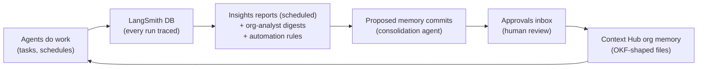

# 07 · Organizational intelligence

*Deep Work planning docs · 2026-07-22. How Deep Work is configured as a work system and then learns and understands the org over time — using the LangSmith DB, Context Hub, traditional databases, and (eventually) graph/ontology tooling. Research grounding: [15-org-intelligence](../research/15-org-intelligence.md). Policy: consume OSS LangChain pieces; build only review UX, task/schedule templates, and provisioning glue.*

## 1. Design stance

Four principles, drawn from where the industry has converged (Devin's Knowledge/Playbooks, Fleet's approval-gated memory, Cowork's project-scoped files, ChatGPT company-knowledge's citations) and from Deep Work's own wrapper model:

1. **Knowledge is reviewable files, not opaque vectors.** Org memory lives as markdown in Context Hub / git — diffable, citable, human-approved. (ChatGPT's non-inspectable reference-history layer is the cautionary example.)
2. **The org owns everything.** Traces in their LangSmith, memory in their Context Hub, graphs/DBs in their infrastructure. Deep Work provides agents, schedules, and review surfaces — no Deep Work-side store.
3. **Writes are proposals.** Agents propose memory/knowledge changes; humans approve them through the same approvals inbox as every other sensitive action (Devin's "proposed knowledge" pattern; Fleet gates memory writes by default; MDA *enforces* read-only org memory at runtime).
4. **The graph earns its way in.** Files + traces first; an explicit temporal graph only when cross-entity/time questions demand it. RDF/OWL is explicitly out — the working ontology patterns in this ecosystem are Pydantic entity/edge types and typed markdown frontmatter.

## 2. The learning loop

Work produces traces; traces produce insights; insights produce proposed memory; approved memory makes the next work better. Every arrow is an existing platform capability — Deep Work builds the review surface and the templates.

## 3. The layer ladder

### Layer 0 — The configured work system (v1)

Context Hub repos as the org's work configuration: `instructions.md`, `skills/`, per-user/tenant `memories/` slices (MDA hot/cold model), and a read-only **`org-memory/`** (who we are, teams, systems, policies, glossary, decision log) mounted at `/memories/org` — writes runtime-denied to agents, updated only via the review loop. The fleet manager already edits these files.

**Build:** an OKF-shaped `org-memory/` starter template + an onboarding flow that interviews the admin to seed it ("configure the work system" = a guided curation task, not new infra).

### Layer 1 — Activity intelligence from traces (v1)

Native LangSmith monitoring, plus the first insights:

- **Tracing conventions** (the part that makes org monitoring work): per-agent tracing projects (open-swe pattern); every run stamped with metadata — `task_type`, `agent`, `actor`, `tenant`, `repo/context`, `surface` — so LangSmith dashboards, filters, and Insights partitions cut cleanly. Every Deep Work screen deep-links to the corresponding LangSmith view; Deep Work never re-implements observability.
- **Insights reports**: provision a saved LangSmith Insights config with `schedule_cron` per tracing project (beta REST: `POST /api/v1/sessions/{id}/insights/configs`, auto-generate from natural language via `/configs/generate`) — hierarchical trace clustering, custom attributes, executive summaries with clickable trace refs. Plus/Enterprise feature; free tier degrades to the org-analyst digest only.
- **Org-analyst schedule template**: cron → agent equipped with the official **langsmith-mcp-server** (runs, thread stats, experiments, usage) → weekly sweep → writes `org-memory/digests/YYYY-WW.md` → notifies. "What did all our agents do this week," synthesized and filed.
- **Automation rules**: HITL rejections/edits → dataset (eval fuel for later); errors → webhook → Deep Work push notification. Mind the tiered `/runs/query` rate limits (10/10s ≤7d windows); Bulk Export (S3/Parquet, scheduled) is the path for warehouse-scale analysis later.

**Build:** schedule templates, the digest skill, Insights-config provisioning glue.

### Layer 2 — Memory synthesis (v1.x)

The documented deepagents **background-consolidation recipe**, productized: a second graph in `packages/agent` (`consolidation_agent`) with an episodic-memory tool (`threads.search` + history over the org's threads), triggered by a cron whose interval equals its lookback window. It consolidates what agents learned — conventions, recurring failures, environment quirks — into **proposed** `org-memory/` commits.

The **review loop** closes it: proposal → Context Hub commit webhook (`context_hub.commit.created.v1`, HMAC-signed) → Deep Work approvals inbox renders the diff → approve = merge, reject = feedback to the consolidation agent. Same HITL surface, new payload type.

**Build:** the propose/review/commit UI; the agent, storage, webhooks, and cron all exist upstream.

### Layer 3 — The org knowledge base (v2)

Adopt **OKF** (Open Knowledge Format — Google's open spec: markdown bundles with typed YAML frontmatter and link-based relationships; v0.1) as the org-brain format, and **openwiki** (MIT, LangChain-maintained, deepagents-based) as the generator: connectors (Gmail, Notion hosted MCP, GitHub, web) → OKF bundle in Context Hub/git → refreshed on schedule → mounted read-only to agents like org memory → humans review diffs. The typed frontmatter is a "poor man's ontology" agents navigate with `grep`/`read_file` — no new query infrastructure.

**Build:** a wiki browse/review surface + sandboxed-scheduler auth design for openwiki connectors. Contribute missing connectors upstream, never fork. **Risk:** OKF is ~6 weeks old; plain markdown + frontmatter degrades gracefully if v0.2 breaks.

### Layer 4 — The structured data plane (v2)

MCP-first access to the org's traditional databases and metrics:

- **Warehouse/metrics**: **dbt-mcp** (dbt Labs official — Semantic Layer metric queries, model discovery) as the flagship connector; governed metrics beat raw text-to-SQL for "the agent understands our business."
- **Operational DBs**: Supabase official MCP / `mcp-server-pg` / Postgres MCP Pro (the archived Anthropic Postgres server has an unpatched SQL-injection issue — never recommend it).
- **Data-analyst task template**: the deepagents `text-to-sql-agent` shape verbatim — `list_tables` / `get_schema` / `query_checker` / `execute_query` tools + `query-writing` / `schema-exploration` skills — with read-only credentials and `interrupt_on` gating query execution.

**Build:** the template and credential UX only. Per-user tool credentials broker through **LangSmith Agent Auth**; long-tail SaaS via user-supplied Arcade/Composio MCP gateways (both platforms are proprietary; their gateways are just MCP servers to us). Deep Work builds zero integrations in-house.

### Layer 5 — The explicit temporal graph (v3, opt-in)

When cross-entity, time-aware questions arrive ("who decided X, when, and what changed since?"), add **Graphiti** (Apache-2.0, `graphiti-core`) on user-provisioned Neo4j/FalkorDB/Neptune: bi-temporal edges, hybrid retrieval, and — critically — **ontology as code**: a small shipped set of Pydantic entity/edge types (Person, Team, Project, System, Decision, Policy; OWNS, DECIDED, DEPENDS_ON) that orgs extend. Ingestion = episodes from task completions, digests, and OKF pages; access = Graphiti's own MCP server, mounted as just another connector. `langchain-neo4j` (now home of `LLMGraphTransformer`) covers extraction-from-text needs.

Defer entirely if Layers 1–3 satisfy demand.

## 4. What Deep Work builds vs consumes (this feature area)

| Consume (upstream, with releases) | Build (genuinely necessary) |
|---|---|
| LangSmith Insights + automations + runs/query + bulk export | Insights/automation provisioning glue |
| langsmith-mcp-server | Org-analyst, consolidation, data-analyst **templates** |
| deepagents memory middleware + consolidation recipe + Store semantic search | Memory **propose/review/commit UI** |
| Context Hub (repos, webhooks) + MDA memory slices | `org-memory/` starter template + onboarding interview |
| openwiki + OKF | Wiki browse/review surface |
| dbt-mcp, Supabase MCP, mcp-server-pg | Credential UX |
| Graphiti + langchain-neo4j (v3) | Shipped ontology preset (Pydantic types) |
| langchain-auth (Agent Auth) | — |

Explicitly rejected: langmem as a foundation (pre-1.0, slow), Mem0's opaque-store model (conflicts with reviewable-files stance), Zep CE (dead — its OSS successor *is* Graphiti), langchain-kuzu (stale; Kuzu deprecated in Graphiti too), RDF/OWL, and any in-house connector platform.

## 5. Roadmap placement

- **v1 (M3):** Layer 0 template + onboarding seeding; Layer 1 tracing conventions, org-analyst schedule template, Insights deep links (API provisioning if the beta probe succeeds).
- **v1.x:** Layer 2 consolidation agent + review loop (the Context Hub webhook consumer is the only new service surface).
- **v2:** Layers 3–4. **v3:** Layer 5.

## 6. Open questions (tracked)

1. Insights beta REST: can full report payloads (categories, exec summaries) be read back via API, or UI-only? → M1 probe with the beta account.
2. Context Hub write scopes under "Sign in with LangSmith" OAuth (the review loop commits via the Hub API). → extends the existing OAuth spike.
3. OKF v0.1 → v0.2 stability. 4. openwiki-in-sandbox connector auth design. 5. Multi-workspace orgs: Insights/automations are per-workspace — the "whole org" view may need iteration under org-scoped keys.
