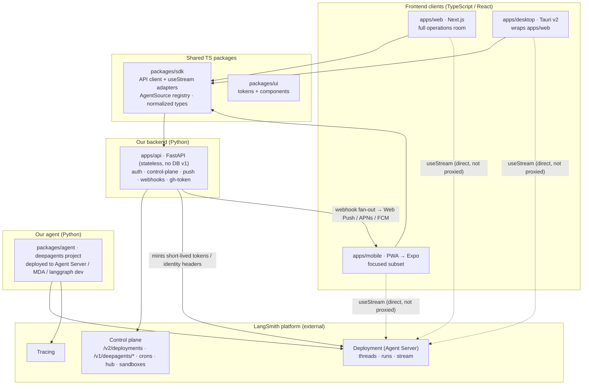

# Deep Work — Application Architecture Plan

*Architecture decision doc · 2026-07-23 · Status: proposed*
*Evolves [../plan/02-architecture.md](../plan/02-architecture.md) §1 (the app-tier decision) for a Python backend + explicit multi-surface split. Companion: [code-conventions.md](code-conventions.md).*

---

## The decision in one paragraph

Deep Work becomes **four deployables of our own** around the LangSmith platform: a **Python backend** (`apps/api`, FastAPI, stateless) that owns all control-plane glue and auth; a **Python agent** (`packages/agent`, deepagents) that is the actual agent runtime; a **web/desktop frontend** (Next.js wrapped by Tauri) that is the full operations room; and a **mobile frontend** (PWA first, Expo later) that is the focused on-the-go surface. The one thing that does **not** flow through the Python backend is the live run stream — clients open `@langchain/react` `useStream` **directly** against the deployment, which is the LangChain-native pattern. Everything else (deployments, agents, crons, hub, sandboxes, auth, push, webhooks) goes through the Python backend so the server side is first-class LangChain Python and matches community conventions.

This is a deliberate evolution of the original "thin Next.js glue, no backend of its own" design (02-architecture §1): still **no database in v1**, still stateless, but the glue moves from scattered Next.js route handlers into **one Python service** that all three client surfaces share.

---

## Why these choices

### Why a Python backend (not Next.js route handlers)

The original design was right that LangSmith *is* the backend and Deep Work needs almost none of its own. But three forces push the remaining glue into a dedicated Python service:

1. **Multi-surface.** Web, desktop, and mobile all need the same glue (auth, control-plane calls, push, webhooks). Implementing it once in Next.js route handlers means desktop and mobile either re-implement it or tunnel through the web app. One Python backend serves all three uniformly.
2. **First-class LangChain SDKs are Python.** `langsmith`, `langgraph-sdk`, `langchain-auth`, the deepagents tooling — the richest, best-maintained clients are Python. A Python backend uses them directly instead of reaching for thinner TS equivalents.
3. **Community fit (the explicit goal).** The LangChain community writes Python with a specific, well-documented toolchain and style (uv, ruff `ALL`, mypy strict, Google docstrings — see [code-conventions.md](code-conventions.md)). A Python backend + Python agent means the **entire server side follows those conventions** and is upstreamable/contributable in the LangChain idiom.

**Cost, stated honestly:** one more service to deploy than a Next-only app. Mitigated because it is **stateless** (no DB, no session store beyond a signed token), deploys anywhere Python runs (including next to the agent infra), and scales trivially.

### Why streaming stays client-direct (the crux)

Live runs stream over SSE/WebSocket via `@langchain/react` `useStream`. **We do not proxy this through the Python backend.** Proxying a long-lived stream would add latency, break `stream_resumable` + `Last-Event-ID` replay semantics, duplicate what `useStream` already does, and put the backend on the critical path of every token. Instead:

- **Data plane (the run stream):** client → deployment URL, directly, via `useStream`.
- **Control plane (everything else):** client → `apps/api` (Python) → LangSmith.

The Python backend **brokers the auth** for the direct stream (mints short-lived scoped tokens / identity headers) but is not in the byte path. This is exactly the LangChain-native separation and is what keeps the client written once against `useStream`.

### Why web+desktop share, and mobile is separate

- **Web + Desktop are the same app.** Desktop (Tauri v2) wraps the Next.js web build in a native shell (tray, notifications, deep links, device-flow sign-in, updater). One UI codebase, two delivery vehicles. This is the full operations room — inbox, task detail, approvals, fleet, schedules, settings, activity.
- **Mobile is a focused subset, not the whole room.** On a phone you want: triage the inbox, watch/steer a running task, and approve interrupts — with push. You do not want the full fleet-config matrix. So mobile is its own surface: **PWA first** (installable, offline shell, bottom-bar nav, Web Push, one-tap approvals) for v1, **Expo/React Native later** (native push via APNs/FCM, deep links) post-v1. It shares `packages/sdk` and the RN-compatible slice of `packages/ui`, but has its own navigation and screen set.

---

## Topology



**Read it as:** clients get *control* answers from our Python backend and *stream* runs straight from the deployment. Our Python agent is the thing running inside LangSmith. Our Python backend never stores state — it brokers.

---

## Component responsibilities

### `apps/api` — Python backend (FastAPI, stateless)

The one backend all clients share. **No database in v1** — state lives in LangSmith; the backend holds only a signed session token.

| Area | Responsibility |
|---|---|
| **Auth** | OAuth 2.1 (Sign in with LangSmith) token exchange + PKCE; RFC 8628 device flow (desktop); API-key brokering (fallback). Issues a signed session token to clients; mints short-lived scoped tokens/identity headers for the direct stream. |
| **Control plane** | Deployments (`/v2/deployments`), agents (`/v1/deepagents/*`), crons, Context Hub, sandboxes — via the `langsmith` + `langgraph-sdk` Python SDKs. |
| **Push** | Receives run-completion webhooks → fans out to Web Push/VAPID (PWA), APNs/FCM (native), desktop notifications. One pipeline, all surfaces. |
| **Webhooks & untrusted payloads** | Ingests external run/schedule payloads behind the untrusted-content boundary (prompt-injection defense). |
| **GitHub App** | Mints short-lived installation tokens for the sandbox auth-proxy callback (zero secrets in sandbox). |
| **Connector/file proxy** | Auth-enforced proxy in front of the agent's sandbox file/diff connector routes (or passes through identity headers). |
| **Not responsible for** | The run stream (client-direct). Persisting product data (none in v1). |

Framework: **FastAPI + uvicorn**, uv-managed, one package following LangChain Python conventions ([code-conventions.md](code-conventions.md)).

### `packages/agent` — Python agent (deepagents)

Unchanged from [02-architecture §3](../plan/02-architecture.md): a runtime-agnostic deepagents project (research / writing / basic-coding task types via assistant configs), deployed to Agent Server / MDA / `langgraph dev`. This is **not** the backend — it is the agent that runs *inside* LangSmith. Follows LangChain Python conventions.

### `apps/web` + `apps/desktop` — full frontend

- **`apps/web`** — Next.js App Router. The operations room. Consumes `packages/sdk` for backend calls and `useStream` for streaming. Keeps a **thin** set of Next route handlers only for same-origin web-session concerns (OAuth redirect landing, httpOnly cookie set/read for SSR) — these call `apps/api` internally; they are session glue, not the backend.
- **`apps/desktop`** — Tauri v2 shell wrapping the web build. Adds tray, native notifications, deep links (`deepwork://`), device-flow sign-in, auto-updater.

Frontend follows **React/Next idioms**, not LangChain library conventions ([code-conventions.md](code-conventions.md) §Frontend).

### `apps/mobile` — focused mobile frontend

- **v1: PWA** — installable, offline app-shell, bottom-bar nav, Web Push, one-tap approval actions. Screen set: inbox triage, task detail (watch + steer), approvals. Shares `packages/sdk` + RN-agnostic `packages/ui` primitives.
- **post-v1: Expo / React Native** — native shell, APNs/FCM push, deep links. Shares `packages/sdk` and the RN-compatible UI slice.

### `packages/sdk` — TypeScript client SDK

The seam between the React clients and both planes:

- **Backend client** — typed calls to `apps/api` (control-plane operations, auth, push registration).
- **Streaming adapters** — wraps `@langchain/react` `useStream`; the `AgentSource` registry (MDA deployment / any URL / `langgraph dev`); normalized projection types; **casing hygiene lives here and nowhere else** (per 02-architecture §7).

Consumed identically by web, desktop, and mobile.

### `packages/ui` — design system

Tokens (`tokens.css`) + tailwind preset + shadcn-based components. The web/desktop consume the full set; mobile consumes the RN-compatible slice.

---

## Workspace layout

Reconciles the app-monorepo shape (`apps/` + `packages/`, per [05-oss-setup](../plan/05-oss-setup.md) and deepagentsjs) with LangChain's shared-`internal/` pattern and a Python backend:

```
deepwork/
  apps/
    api/            # Python · FastAPI backend (uv, ruff, mypy) — LangChain Python conventions
    web/            # Next.js · full operations room (React/Next conventions)
    desktop/        # Tauri v2 · wraps apps/web
    mobile/         # PWA v1 → Expo post-v1 · focused subset
  packages/
    agent/          # Python · deepagents project (uv, ruff, mypy) — LangChain Python conventions
    sdk/            # TS · backend client + useStream adapters — langchainjs conventions
    ui/             # TS · tokens + components — langchainjs conventions
  internal/         # shared TS build/config (mirrors langchainjs internal/*)
    tsconfig/       # @deepwork/tsconfig — shared base.json
    build/          # @deepwork/build — tsdown wrapper
  docs/
```

**Two toolchains, cleanly split:**
- **Python** (`apps/api`, `packages/agent`) — uv workspace, ruff, mypy, pytest. Follows LangChain Python conventions.
- **TypeScript** (`apps/web`, `apps/desktop`, `apps/mobile`, `packages/*`, `internal/*`) — pnpm + Turborepo, oxlint + oxfmt, tsdown for libraries, vitest. Library packages follow langchainjs conventions; the apps follow framework-native conventions.

Turborepo orchestrates both (Python packages expose `test`/`lint` task wrappers that shell to uv/ruff — same pattern the delivery plan already uses).

---

## Key data flows

**Dispatch a task**
```
composer (web/mobile) → packages/sdk → apps/api: POST create-run
  → apps/api uses langgraph-sdk to start a thread on the deployment
  → returns {threadId, deploymentUrl, streamToken}
  → client opens useStream(deploymentUrl, streamToken) directly → live narration
```

**Approve an interrupt**
```
approvals view → packages/sdk → apps/api: POST decision
  → apps/api resolves the interrupt via langgraph-sdk respond()
  → client's open useStream resumes streaming
```

**Run completes while app backgrounded (mobile)**
```
deployment fires run-completion webhook → apps/api /webhooks
  → apps/api push fan-out → Web Push / APNs / FCM
  → tap notification → deep link → task detail → useStream re-attaches (Last-Event-ID)
```

**Deploy/update an agent (fleet)**
```
agent builder → packages/sdk → apps/api: PATCH agent config
  → apps/api uses langsmith/langgraph-sdk: hub write / deployment revision
  → (MDA vs classic path per M0 Spike 2 outcome)
```

---

## What this changes vs the current spec

| 02-architecture §1 said | This plan says | Why |
|---|---|---|
| "thin glue service (Next.js server routes)" | dedicated **Python backend** (`apps/api`); Next keeps only session glue | multi-surface + Python community fit |
| glue split across web server routes | **one backend** for web/desktop/mobile | avoid per-surface duplication |
| (implied) TS-only server side | **Python** server side (backend + agent) | first-class LangChain SDKs + conventions |
| "no database of its own in v1" | **unchanged** — still stateless, no DB | LangSmith remains the system of record |
| clients use `useStream` direct | **unchanged** — streaming still client-direct | never proxy the byte path |

Everything else in 02-architecture (runtime tiers, three identity planes, execution/sandbox model, control-plane surface map, streaming projections, OSS dependency policy, dcode companion) **carries forward unchanged**. This doc only re-decides the app tier.

---

## Open questions to resolve next

- **Session/cookie topology.** Same parent domain for `apps/web` + `apps/api` (cookie domain `.deepwork.dev`) vs web-app proxy to backend. Affects OAuth callback + httpOnly cookie handling. Lean: shared parent domain, web keeps a minimal callback route.
- **Backend deploy target.** Where `apps/api` runs (container on the user's infra for self-host; managed for hosted). It is stateless so this is flexible; document a reference deploy.
- **How much of the connector/file browsing is proxied vs client-direct.** The agent already exposes identity-enforced connector routes; the backend may only need to broker auth, not proxy bytes. Decide during U13.
- **Mobile screen-set line.** Exact v1 PWA scope (inbox + detail + approvals) vs a bit more (schedules?). Decide at M4 entry.
```
