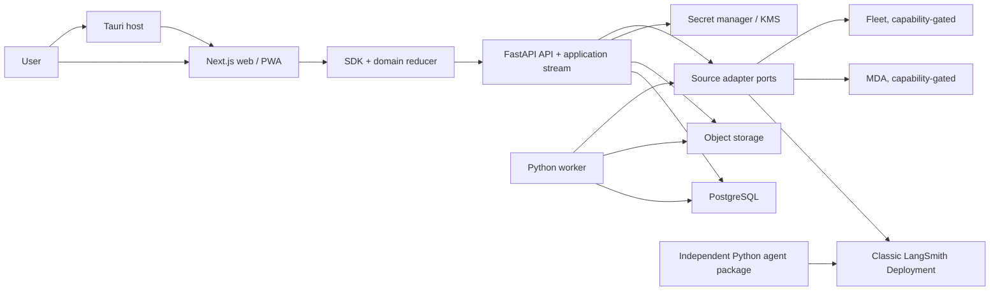

# Deep Work architecture

> Staged draft for eventual root `ARCHITECTURE.md`. It is not active or canonical
> until the proposal review and merge map are complete.

## Purpose

This file is the concise map of deployable units, package ownership, state and
credential authority, legal dependencies, and enforcement. Detailed rationale
lives in `docs/design-docs/architecture/`; product behavior lives in
`docs/product-specs/`; implementation progress lives in `docs/exec-plans/`.

## System



Classic LangSmith Deployment is the supported public v1 baseline. Managed Deep
Agents and Fleet expose only capabilities proven for the pinned entitlement and
adapter version. The application service does not replace Agent Server or official
deployment tooling.

## Deployable units

| Unit | Owns | Must not own |
|---|---|---|
| `apps/api` API | session/authorization, source registry, `/api/v1`, normalized stream, object authorization, provider adapter selection | agent graph, UI, reusable credentials in responses |
| `apps/api` worker | outbox/jobs, webhook/source reconciliation, notifications, scans/object lifecycle | UI, Symphony scheduling, source-of-truth runs |
| `packages/agent` | independently locked/deployed Deep Agents graph, typed config, tools/middleware, tests/evals | FastAPI routes, app tables/sessions/secrets |
| `apps/web` | routes, responsive journeys, query/stream composition, accessible presentation | durable job truth, raw provider protocols/secrets |
| `apps/desktop` | exact-origin Tauri host, typed native bridge, deep links/tray/notifications/updater | second UI/domain/API/provider client |
| PostgreSQL | app identities/sessions/sources/projections/drafts/preferences/idempotency/jobs/audit | object bytes, raw secrets, upstream run/trace authority |
| Object store | bounded app attachments/imports/exports and safe previews | raw credentials, unbounded upstream mirrors |

## Package graph

```text
packages/domain <- packages/sdk <- apps/web
       ^                           |
       +------ packages/ui <-------+

apps/desktop -> exact hosted web origin + typed native bridge
apps/api -> domain/ports/application/adapters/transport/bootstrap
packages/agent -> public Deep Agents/LangChain/LangGraph APIs
```

- `packages/domain` is pure TypeScript: no React, Next.js, SDK, HTTP, generated
  wire model, environment, provider, credential, Node-only, or Tauri dependency.
- `packages/sdk` consumes domain plus generated Deep Work transport; no UI,
  provider SDK, server secret/reference, app route, or desktop implementation.
- `packages/ui` consumes domain plus presentation dependencies; no SDK/network,
  generated DTO, fixture, route, provider, or environment dependency.
- `apps/web` is the client composition root. React components do not construct
  provider or Deep Work URLs; SDK services own application requests.
- `apps/desktop` exposes narrow capability adapters and never forks routes,
  reducers, product components, or network services.
- The frontend prototype is a one-way visual/interaction source and is never an
  import dependency.

## Python layers

```text
deepwork_api/
  domain/       pure types, policies, transitions
  ports/        repositories and provider/cross-cutting interfaces
  application/  use cases, authorization and transactions
  adapters/     persistence, sources, secrets, objects, GitHub, notifications
  workers/      job handlers calling application services
  transport/    HTTP/stream/webhook validation and mapping
  contracts/    explicit wire schemas and generation policy
  bootstrap/    concrete composition and process entry points
```

Legal direction is inward. `domain` depends only on deliberate pure helpers;
`ports` depends on domain; `application` depends on domain/ports; transport and
workers call application; adapters implement ports; `bootstrap` is the only
routine concrete wiring zone. SQLAlchemy records never serialize as API schemas.
Provider SDKs remain in source adapters or the independent agent package.

Business-domain subfolders use the same names across roots. A machine manifest
checks both layer edges and domain-to-domain edges.

## State and credentials

| State | Authority | Deep Work copy |
|---|---|---|
| agent/deployment/thread/run/checkpoint/interrupt/trace | selected source | qualified identity/projection/recovery/provenance only |
| session/tenant/actor/preferences/source registration/draft/audit | Deep Work | durable, tenant-scoped, revocable |
| provider credential | secret manager/KMS | opaque server reference and health only |
| application attachment/import/export | object store | authorized metadata and lifecycle in Postgres |
| fixture | repository/local demo services | synthetic, deterministic, schema-valid, credential-free |

`AgentSourceRecord` is server-only and may hold exact endpoint, workspace context,
and `authRef`. `AgentSourceView` contains identity, sanitized endpoint label or
authorized deep link, credential health, source health, and evidence-bearing
capabilities—never a reusable credential, `authRef`, or generic proxy target.

Every capability records state (`available`, `unavailable`, `gated`,
`permission-denied`, or `unknown`), observation time, adapter/contract version,
evidence class, and safe reason. Unknown or permission-denied is never treated as
available.

## Application contract and stream

- FastAPI `/api/v1` plus generated OpenAPI is the application wire authority.
- The browser-safe SDK validates/maps DTOs and keeps ordinary query/mutation
  services separate from active-stream control.
- FastAPI owns upstream provider selection, credentials, headers, protocol/cursors,
  replay/dedupe, and per-source aggregation.
- Clients receive normalized events with source provenance, application ordering,
  and opaque recovery token. Provider cursors remain server-side.
- Reconnect uses bounded application replay, then authoritative hydration with an
  explicit freshness/recovered boundary.
- Ordered HITL preserves action requests, aligned review configurations, and one
  decision per action. No partial batch or user-visible force-resolve exists.

## Fixture and worktree model

- The **UI harness** is browser-local and proves isolated component/route/state and
  responsive behavior only.
- The **product demo** runs fixture API, worker, Postgres, object service, web, and
  telemetry. It proves full-stack fixture behavior and live-normalized parity.
- Each agent/Symphony workspace receives a collision-free path, ports,
  database/schema, object prefix, browser origin/storage, telemetry namespace, and
  proof directory. It can restart and tear down without affecting another.

## Mechanical enforcement

`tools/architecture/graph.yaml` is the machine-readable authority for zones,
allowed imports, public entry points, server/browser classification, provider
locations, composition roots, and exceptions. `make check-architecture` enforces:

- no undeclared/cyclic package or domain edge;
- no deep/private cross-package or upstream import;
- no provider SDK/secret type outside approved server/agent zones;
- no FastAPI in domain/application or SQLAlchemy in transport/contracts;
- no React/Next/network/generated DTO in `packages/domain`;
- no SDK/network/provider import in `packages/ui`;
- no raw `fetch` in React components or generic URL/method/header forwarding API;
- no concrete-adapter import outside bootstrap/adapter tests;
- no raw environment read outside typed configuration/bootstrap;
- deterministic generated OpenAPI/schema/package/architecture views;
- structured boundary errors/logging without secret/untrusted content; and
- no unowned TODO/FIXME.

Failures name the rule, file, legal destination, architecture anchor, and local
repair command. Exceptions need owner, issue, rationale, affected edge, expiry or
review trigger, and deletion test. Secret, tenant, and browser credential rules
cannot be waived.

## Release boundaries

- Responsive web is the required v1 client; PWA install/push/offline enhancement is
  browser-qualified and falls back to ordinary responsive web/in-app state.
- Tauri is a separately qualified release train; failure holds desktop, not web.
- Expo/native mobile is post-v1 and reuses only domain and proven platform-neutral
  client core with native auth/storage/stream/connectivity/push adapters.
- API, worker, agent, web/service worker, and desktop artifacts roll back only
  within an accepted schema/compatibility matrix.

## Canonical detail

- Product roadmap: `docs/PLANS.md`
- Product intent: `docs/PRODUCT_SENSE.md`
- Detailed application design: `docs/design-docs/architecture/application-architecture.md`
- Engineering conventions: `docs/design-docs/engineering/conventions.md`
- Security/reliability/frontend/design: topical docs under `docs/`
- Stable feature outcomes: `docs/product-specs/`
- Living implementation: `docs/exec-plans/active/`
- Source and contract evidence: `docs/references/`

If code and this graph disagree, stop and resolve the architecture decision before
making a boundary exception or changing the checker.
